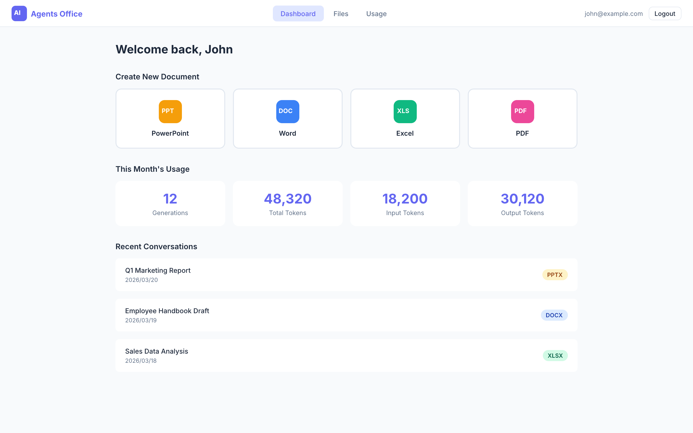
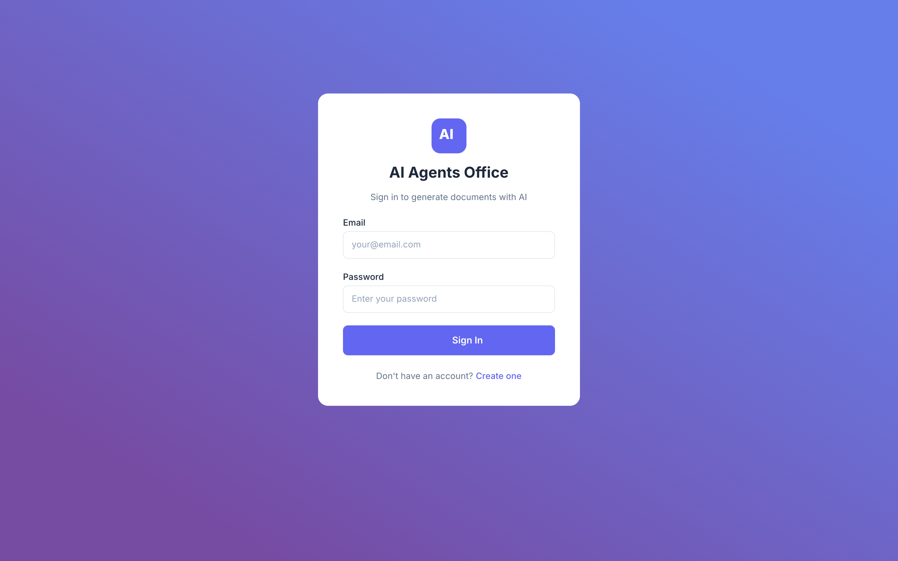
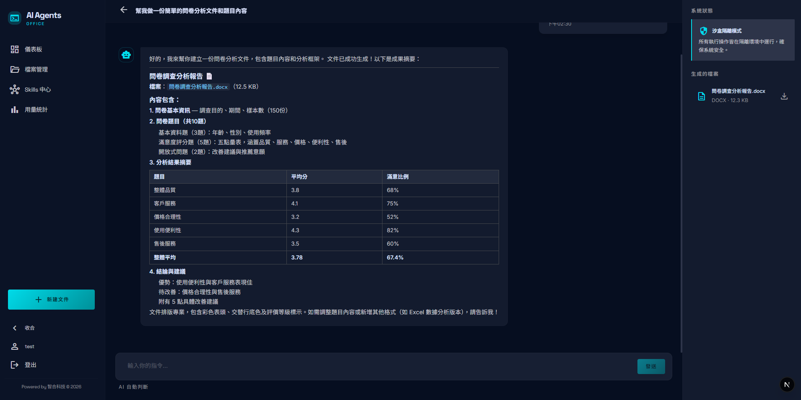
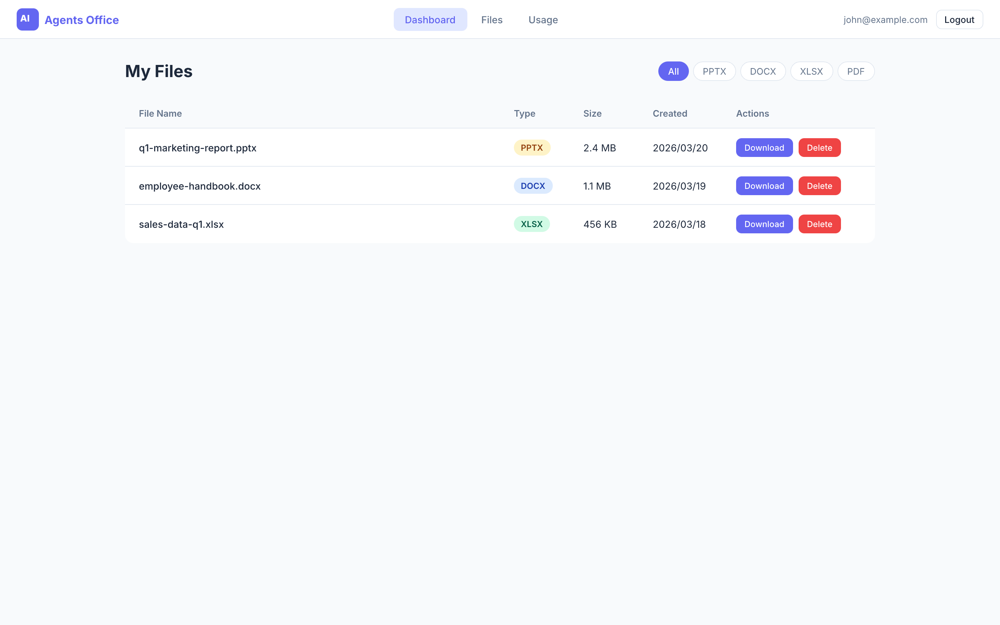

# AI Agents Office

AI 驅動的文件生成服務。使用者透過網頁介面描述需求，系統調度本地 Claude CLI 代理自動生成 PowerPoint、Word、Excel、PDF 文件。



## 功能特色

- **多代理協作** - Router Agent 分析需求，自動調度專業 Worker Agent 協同完成任務
- **5 種文件類型** - 支援 PPTX、DOCX、XLSX、PDF 生成 + HTML 互動簡報，各有專屬技能代理
- **即時串流** - 基於 SSE 的即時進度推送，可視化代理活動狀態
- **聊天嵌入圖表** - AI 回應中自動嵌入互動式圖表（Recharts: bar/line/area/pie/radar/scatter），支援放大、下載 PNG/SVG
- **互動式心智圖** - Markmap 驅動的可收合/展開樹狀心智圖，支援縮放、拖曳、下載
- **Mermaid 圖表** - 支援流程圖、甘特圖、ERD、序列圖等，自動偵測暗色/亮色主題
- **線上簡報** - HTML 互動式簡報（Reveal.js），支援 Tooltip、hover 動畫、圖表互動效果
- **檔案內嵌預覽** - 聊天中直接預覽 PDF、Word、Excel、PPT 第一頁，含版本切換
- **沙箱隔離** - 5 層安全防禦模型，每位使用者檔案獨立隔離
- **管理後台** - 使用者管理、角色切換、Token 用量分析、操作稽核日誌
- **多輪對話** - 持久化代理 Session，支援跨回合對話記憶
- **Google OAuth** - 支援 Google 第三方登入，可與 email 帳號自動關聯
- **多語系** - 支援繁體中文、簡體中文、英文介面切換（所有 UI 元素完整 i18n）
- **暗色/亮色主題** - 全站支援 Dark/Light Mode，所有圖表和元件自動適應
- **浮水印** - 生成文件自動加上浮水印（PPTX、DOCX、XLSX、PDF）

## 畫面截圖

| 登入 | 聊天 | 檔案管理 |
|------|------|----------|
|  |  |  |

## 技術棧

| 層級 | 技術 |
|------|------|
| 後端 | Express 5 + TypeScript |
| 前端 | Next.js 15 (App Router) + Tailwind CSS |
| 資料庫 | SQLite (better-sqlite3) |
| 認證 | bcrypt + JWT + Google OAuth |
| AI 引擎 | Claude CLI（本地行程生成） |
| 串流 | Server-Sent Events (SSE) |
| 文件生成 | pptxgenjs, docx, exceljs, pdfkit, pdf-lib |
| 圖表/圖形 | Recharts, Mermaid, Markmap（互動式心智圖） |
| 簡報引擎 | Reveal.js（HTML 互動簡報） |

## 系統架構

```
                    ┌──────────────┐
                    │   Next.js    │ :12053
                    │     前端     │
                    └──────┬───────┘
                           │ SSE / REST
                    ┌──────┴───────┐
                    │   Express    │ :12054
                    │     後端     │
                    └──────┬───────┘
                           │
              ┌────────────┼────────────┐
              │            │            │
        ┌─────┴─────┐ ┌───┴───┐ ┌─────┴─────┐
        │  Claude    │ │SQLite │ │ Workspace  │
        │  CLI 代理  │ │ 資料庫 │ │  (沙箱)    │
        └─────┬─────┘ └───────┘ └────────────┘
              │
    ┌─────────┼─────────┐
    │         │         │
  Router   Workers   Generators
  路由代理  工作代理    文件生成器
          (research,  (pptx, docx,
          planner,    xlsx, pdf)
          reviewer)
```

### 多代理工作流程

1. 使用者發送訊息（例如「研究 AI 趨勢並製作簡報」）
2. **Router Agent** 分析請求，輸出 `[TASK]` / `[PIPELINE]` 任務區塊
3. **Worker Agents** 依序或並行執行任務
4. 結果回饋給 Router 進行迭代優化（最多 3 輪）
5. 生成的檔案自動註冊，可供下載

```
使用者訊息 → Router Agent → [TASK:research] → Research Agent
                          → [TASK:pptx-gen] → PPTX Agent → output.pptx
```

### 執行模式

| 模式 | 觸發條件 | 行為 |
|------|----------|------|
| **協作模式** | 未指定技能 | Router 調度多個 Worker 協同工作 |
| **直接模式** | 在 UI 選擇特定技能 | 單一代理獨立處理 |

## 專案結構

```
ai-agents-office/
├── server/                     # Express API 後端
│   ├── src/
│   │   ├── routes/             # API 端點（auth, generate, files, admin...）
│   │   ├── services/           # 核心邏輯（orchestrator, claudeCli, sandbox...）
│   │   ├── middleware/         # 認證、速率限制
│   │   ├── skills/             # 代理技能定義
│   │   │   ├── router/         #   請求分析與任務調度
│   │   │   ├── pptx-gen/       #   PowerPoint 生成
│   │   │   ├── docx-gen/       #   Word 文件生成
│   │   │   ├── xlsx-gen/       #   Excel 試算表生成
│   │   │   ├── pdf-gen/        #   PDF 生成
│   │   │   ├── slides-gen/     #   HTML 互動簡報生成
│   │   │   ├── research/       #   網路研究與彙整
│   │   │   ├── data-analyst/   #   數據分析
│   │   │   ├── rag-analyst/    #   跨檔案 RAG 分析
│   │   │   ├── planner/        #   規劃與大綱
│   │   │   └── reviewer/       #   審閱與品質把關
│   │   ├── generators/         # 文件生成腳本（pptxgenjs, docx 等）
│   │   ├── config.ts           # 應用程式設定
│   │   └── db.ts               # SQLite 結構與初始化
│   ├── scripts/
│   │   ├── copy-assets.mjs     # 建置時複製非 TS 資源檔
│   │   └── init-db.mjs         # 資料庫初始化腳本
│   └── package.json
├── client/                     # Next.js 前端
│   ├── src/app/
│   │   ├── dashboard/          # 主控台
│   │   ├── chat/[id]/          # 聊天介面（含代理活動視覺化）
│   │   ├── files/              # 檔案總管
│   │   ├── skills/             # 技能中心
│   │   ├── usage/              # Token 用量分析
│   │   ├── admin/              # 管理後台
│   │   ├── login/              # 登入頁（含 Google OAuth）
│   │   ├── register/           # 註冊頁（含 Google OAuth）
│   │   ├── components/         # 共用元件（AuthProvider, Navbar...）
│   │   │   └── charts/         #   聊天嵌入圖表（ChatChart, ChatMermaid, ChatMindmap）
│   ├── src/i18n/               # 多語系（zh-TW, zh-CN, en）
│   └── package.json
├── workspace/                  # 沙箱輸出目錄（依使用者/對話隔離）
├── designs/                    # UI 設計參考
├── .env.example                # 環境變數範本
├── pnpm-workspace.yaml         # Monorepo 設定
└── CLAUDE.md                   # 專案指引
```

## 快速開始

### 前置需求

- **Node.js** 18+
- **pnpm**（套件管理器）
- **Claude CLI** 全域安裝：
  ```bash
  npm install -g @anthropic-ai/claude-code
  ```

### 安裝

```bash
# 複製專案
git clone <your-repo-url>
cd ai-agents-office

# 一鍵安裝（安裝依賴 + 初始化資料庫 + 建置）
pnpm run setup

# 或手動逐步安裝：
pnpm install
cp .env.example .env
# 編輯 .env，設定 JWT_SECRET 為安全的隨機字串
pnpm run init-db
```

### 啟動開發環境

```bash
# 同時啟動前後端
pnpm run dev

# 或分別啟動
pnpm run dev:server   # Express API：http://localhost:12054
pnpm run dev:client   # Next.js UI：http://localhost:12053
```

### 啟動生產環境

```bash
# 建置
pnpm run build

# 啟動
pnpm run start

# 或分別啟動
pnpm run start:server   # Express 生產伺服器
pnpm run start:client   # Next.js 生產伺服器
```

### 預設管理員帳號

執行 `init-db` 後會建立管理員帳號：
- **信箱**：`admin@zhaoi.ai`
- **密碼**：*（見 `server/src/db.ts` 中的 seed 資料）*

## 環境變數

| 變數 | 預設值 | 說明 |
|------|--------|------|
| `PORT` | `12054` | Express 伺服器連接埠 |
| `JWT_SECRET` | - | **必填**，JWT 簽章金鑰 |
| `NODE_ENV` | `development` | 環境模式 |
| `WORKSPACE_ROOT` | `./workspace` | 沙箱輸出根目錄 |
| `CLAUDE_CLI_PATH` | `claude` | Claude CLI 執行檔路徑 |
| `STORAGE_QUOTA_GB` | `2` | 每位使用者儲存空間上限（GB） |
| `GOOGLE_CLIENT_ID` | - | Google OAuth Client ID（選填，未設定則不顯示 Google 登入按鈕） |
| `NEXT_PUBLIC_GOOGLE_CLIENT_ID` | - | 前端 Google OAuth Client ID（與上方相同值） |

## Google OAuth 設定（選填）

如需啟用 Google 第三方登入：

1. 前往 [Google Cloud Console](https://console.cloud.google.com/apis/credentials)
2. 建立新專案或選擇現有專案
3. 建立 **OAuth 2.0 Client ID** → 應用程式類型選「Web application」
4. **Authorized JavaScript origins** 加入：
   - 開發：`http://localhost:12053`
   - 生產：`https://your-domain.com`
5. **Authorized redirect URIs** 加入同上的 URL
6. 複製 Client ID，設定到環境變數：
   ```bash
   # server/.env
   GOOGLE_CLIENT_ID=xxx.apps.googleusercontent.com

   # client/.env.local
   NEXT_PUBLIC_GOOGLE_CLIENT_ID=xxx.apps.googleusercontent.com
   ```

> 未設定 `GOOGLE_CLIENT_ID` 時，Google 登入按鈕不會顯示，不影響既有 email/password 登入功能。

## API 端點

### 認證

| 方法 | 端點 | 說明 |
|------|------|------|
| POST | `/api/auth/register` | 建立帳號 |
| POST | `/api/auth/login` | 登入，回傳 JWT |
| POST | `/api/auth/google` | Google OAuth 登入/註冊 |
| GET | `/api/auth/me` | 取得目前使用者資訊 |
| PATCH | `/api/auth/password` | 修改/設定密碼 |

### 對話

| 方法 | 端點 | 說明 |
|------|------|------|
| GET | `/api/conversations` | 列出對話 |
| POST | `/api/conversations` | 建立對話 |
| GET | `/api/conversations/:id` | 取得對話與訊息 |
| PATCH | `/api/conversations/:id` | 更新標題/狀態 |

### 生成

| 方法 | 端點 | 說明 |
|------|------|------|
| POST | `/api/generate/:id` | SSE 串流生成 |
| GET | `/api/generate/skills` | 列出可用技能 |

### 檔案

| 方法 | 端點 | 說明 |
|------|------|------|
| GET | `/api/files` | 列出檔案（可篩選） |
| GET | `/api/files/:id/download` | 下載檔案（含浮水印） |
| GET | `/api/files/:id/preview` | 預覽檔案（含浮水印） |
| DELETE | `/api/files/:id` | 刪除檔案 |

### 管理後台

| 方法 | 端點 | 說明 |
|------|------|------|
| GET | `/api/admin/overview/stats` | 系統統計 |
| GET | `/api/admin/overview/token-velocity` | 每日 Token 用量 |
| GET | `/api/admin/users` | 使用者管理 |
| PATCH | `/api/admin/users/:id/status` | 停用/啟用使用者 |
| PATCH | `/api/admin/users/:id/role` | 切換使用者角色 |
| GET | `/api/admin/security/audit-log` | 稽核日誌 |

## 安全模型

系統採用 **5 層縱深防禦**：

1. **身分認證** - JWT Token，7 天效期
2. **輸入驗證** - 訊息消毒、10K 字元限制、路徑穿越攔截
3. **沙箱隔離** - 所有檔案限制在 `workspace/{userId}/{conversationId}/` 內
4. **工具限制** - Claude CLI 代理依角色授予不同工具權限：
   - Router：僅 `WebSearch`、`WebFetch`（唯讀）
   - Worker：`Bash(node:*)`、`Write`、`Read`、`WebSearch`、`WebFetch`
   - 封鎖：`Edit`、`rm`、`del`、`sudo`、`curl`、`wget`、`powershell`
5. **檔案驗證** - 路徑正規化、工作區邊界檢查

額外防護：
- **速率限制**：每位使用者 30 次/分鐘
- **儲存配額**：每位使用者 2 GB（可設定）
- **管理稽核**：所有管理員操作皆記錄
- **bcrypt**：12 輪密碼雜湊
- **浮水印**：所有生成文件自動加上浮水印

## 技能系統

每個技能由 `SKILL.md` 檔案定義，包含 YAML frontmatter 中繼資料與系統提示詞。

| 技能 | 角色 | 檔案輸出 | 說明 |
|------|------|----------|------|
| `router` | 路由器 | - | 分析請求、調度任務 |
| `pptx-gen` | 工作者 | `.pptx` | PowerPoint 簡報生成 |
| `docx-gen` | 工作者 | `.docx` | Word 文件生成 |
| `xlsx-gen` | 工作者 | `.xlsx` | Excel 試算表生成 |
| `pdf-gen` | 工作者 | `.pdf` | PDF 文件生成 |
| `slides-gen` | 工作者 | `.html` | 互動式 HTML 簡報（Reveal.js） |
| `research` | 工作者 | - | 網路研究與資料彙整（含圖表、心智圖、Mermaid 圖表） |
| `data-analyst` | 工作者 | - | 數據分析（含圖表、Mermaid 圖表） |
| `rag-analyst` | 工作者 | - | 跨檔案 RAG 分析（含圖表、Mermaid 圖表） |
| `planner` | 工作者 | - | 規劃與大綱撰寫 |
| `reviewer` | 工作者 | - | 審閱與品質把關 |

### 聊天嵌入圖表

AI 回應中可自動嵌入互動式視覺化元件，使用 fenced code block 語法：

| 類型 | 語法 | 渲染引擎 | 互動功能 |
|------|------|----------|----------|
| 資料圖表 | ` ```chart ` | Recharts | Tooltip、放大、下載 PNG |
| 流程圖/ERD/甘特圖 | ` ```mermaid ` | Mermaid | 放大、下載 SVG/PNG |
| 互動心智圖 | ` ```mindmap ` | Markmap | 收合/展開、縮放、拖曳、下載 |

所有圖表支援 Dark/Light 主題自動切換、全螢幕放大、SVG/PNG 下載。

### 代理逾時設定

| 代理 | 逾時 |
|------|------|
| Router | 2 分鐘 |
| Research | 3 分鐘 |
| Planner | 5 分鐘 |
| Reviewer | 2 分鐘 |
| PPTX Gen | 10 分鐘 |
| DOCX Gen | 8 分鐘 |
| XLSX Gen | 5 分鐘 |
| PDF Gen | 5 分鐘 |

## 資料庫

SQLite 資料庫，包含以下資料表：

- **`users`** - 使用者帳號，含角色（`user`/`admin`）、狀態（`active`/`suspended`）、OAuth 資訊
- **`conversations`** - 對話工作階段，追蹤模式（`direct`/`orchestrated`）
- **`messages`** - 對話訊息（user/assistant/system）
- **`generated_files`** - 檔案註冊表（含中繼資料）
- **`token_usage`** - 每次呼叫的 Token 消耗紀錄
- **`task_executions`** - 多代理任務狀態追蹤
- **`agent_sessions`** - 持久化 Claude CLI Session（每代理/對話）
- **`admin_audit_log`** - 管理員操作稽核軌跡

## 指令

```bash
pnpm run setup        # 一鍵安裝（install + init-db + build）
pnpm run dev          # 同時啟動前後端（開發）
pnpm run dev:server   # 僅啟動 Express 後端
pnpm run dev:client   # 僅啟動 Next.js 前端
pnpm run build        # 建置生產版本
pnpm run start        # 同時啟動前後端（生產）
pnpm run start:server # 僅啟動 Express 後端（生產）
pnpm run start:client # 僅啟動 Next.js 前端（生產）
pnpm run init-db      # 初始化資料庫（含 seed 資料）
```

## 部署

### Linux 部署

```bash
# 1. 安裝 Node.js 18+ 和 pnpm
curl -fsSL https://deb.nodesource.com/setup_18.x | sudo -E bash -
sudo apt-get install -y nodejs
npm install -g pnpm

# 2. 安裝 Claude CLI
npm install -g @anthropic-ai/claude-code

# 3. 複製專案並安裝
git clone <your-repo-url>
cd ai-agents-office
cp .env.example .env
# 編輯 .env 設定 JWT_SECRET 和其他環境變數
pnpm run setup

# 4. 啟動
pnpm run start
```

### 搭配 Nginx 反向代理

```nginx
server {
    listen 80;
    server_name your-domain.com;

    # Next.js 前端
    location / {
        proxy_pass http://127.0.0.1:12053;
        proxy_http_version 1.1;
        proxy_set_header Upgrade $http_upgrade;
        proxy_set_header Connection 'upgrade';
        proxy_set_header Host $host;
        proxy_cache_bypass $http_upgrade;
    }

    # Express API + SSE
    location /api/ {
        proxy_pass http://127.0.0.1:12054;
        proxy_http_version 1.1;
        proxy_set_header Connection '';
        proxy_set_header Host $host;
        proxy_set_header X-Real-IP $remote_addr;
        proxy_buffering off;           # SSE 必須關閉緩衝
        proxy_cache off;
        proxy_read_timeout 300s;       # 代理任務可能需較長時間
    }
}
```

### 搭配 Cloudflare

如果使用 Cloudflare CDN：

- **關閉 HTTP/3 (QUIC)**：Cloudflare Dashboard → 你的域名 → 速度 → 最佳化 → 通訊協定最佳化 → 關閉 HTTP/3。HTTP/3 的 QUIC 協定會導致 SSE 長連線中斷。
- **SSE 直連**：前端的 SSE 連線直接連到 Express 後端（不經過 Next.js proxy），避免 Next.js 的回應緩衝影響串流。

## 授權

私有專案，保留所有權利。
