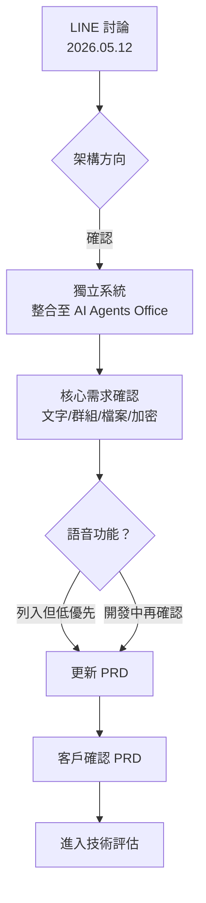

# 會議紀錄

## 1. 會議基本資訊

| 項目 | 內容 |
|------|------|
| 日期 | 2026/05/12 |
| 時間 | 14:30 ~ 15:30 |
| 地點 | LINE 群組（線上非同步討論） |
| 與會人員 | 士碩 Donald（強茂，需求方）、品宏（強茂）、Aken（ZhaoI，產品負責人） |
| 記錄人 | Aken |

---

## 2. 需求背景

強茂集團目前員工內部溝通分散於 LINE、WeChat 等外部工具，公司雖希望禁止使用，但實際上無法完全管控（LINE 為韓國服務、WeChat 為中國服務，各地子公司狀況不同）。去年曾評估 Microsoft Teams 替代方案（Teamplus POC），費用約 100 萬、約 200 user，最終未導入。

客戶明確表示：**不在意功能是否完整，希望有一個「看起來像樣」的內部通訊系統**，作為要求員工轉移至內部平台的依據。AI Agents Office 預計未來也會開放外網存取，因此通訊功能需支援離開公司環境後仍可使用。

---

## 3. 核心需求

依優先級排列：

1. **文字對話（一對一）**
   - 說明：員工之間可直接傳送文字訊息
   - 優先級：高

2. **群組對話（Grouping）**
   - 說明：可建立群組，多人共同討論
   - 優先級：高

3. **檔案傳送**
   - 說明：在對話中傳送文件（格式待確認）
   - 優先級：高

4. **訊息加密**
   - 說明：系統開放外網後，需對伺服器傳輸加密（傳輸加密即可，端對端加密待確認）
   - 優先級：高

5. **檔案預覽**
   - 說明：接收到的檔案可在對話中直接預覽，不需另外下載
   - 優先級：中

6. **語音對話**
   - 說明：客戶提出，但考量伺服器穩定性與載量，實際需求待評估，預計於開發中與客戶再確認
   - 優先級：低

7. **公佈欄（類 Facebook 貼文功能）**
   - 說明：Nice to have，無也可接受
   - 優先級：低

---

## 4. 預期效益

- 提供集團員工一個「公司自有」的內部通訊工具，作為取代 LINE/WeChat 的正式依據
- 系統整合至 AI Agents Office，員工無需切換平台即可溝通與分享 AI 生成文件
- 未來 AI Agents Office 開放外網後，通訊功能同步支援遠端使用

---

## 5. 待確認事項

- [ ] 加密方式：傳輸加密（HTTPS）是否足夠，或需要端對端加密？
- [ ] 語音對話是否列入 MVP 範圍，或僅列為未來規劃？
- [ ] 檔案預覽支援格式範圍（僅圖片？或含 PDF、Office 文件？）
- [ ] 群組人數上限
- [ ] 訊息保留期限
- [ ] 系統與 AI Agents Office 整合時機（現在整合，或待 iOS App 版本後再整合？）

---

## 6. 下一步行動

| 行動項目 | 負責人 | 預計完成日期 |
|----------|--------|-------------|
| 依本次討論更新 IM PRD，補充加密、語音、檔案預覽等細節 | Aken | 2026/05/16 |
| 客戶確認 PRD 內容與待確認事項 | 士碩 Donald | 2026/05/19 |
| 技術評估與工時估算 | ZhaoI 開發團隊 | PRD 確認後 |

---

## 7. 需求決策流程

