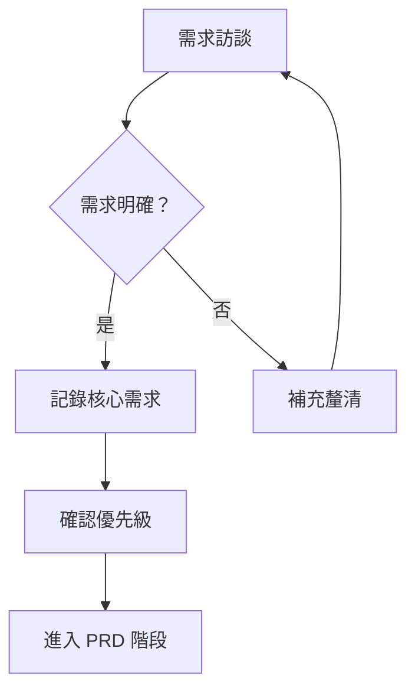

# 會議紀錄

> 主題：Agent Office × LINE Bot 整合（Agent 龍蝦架構）需求討論
> 對應文件：PRD-LINE-Bot-Integration-v0.2

## 1. 需求背景

> 公司已有成熟的 **Agent Office** 系統，具備多 Agent 協作引擎（Router → Worker）、SSE 即時串流、角色權限控管（admin / user / readonly），以及 AD / OAuth / Email 三種認證方式。
>
> 決策方向確定為：**將 LINE Bot 整合進既有的 Agent Office，而非另起爐灶**。整合後將同時存在兩個入口（Web UI + LINE Bot），但共用同一套後端引擎，以 AI 個人助理方式與使用者溝通。
>
> 核心痛點與挑戰：如何讓公司既有的 **AD（Active Directory）帳號體系** 與 LINE 使用者身分安全綁定，並在人員異動（離職／調動）時自動撤銷權限，避免資安缺口。

## 2. 核心需求

依優先級排列需求者期望的功能與目標：

1. **LINE Bot 作為第二入口，共用後端引擎（G1）**
   - 說明：LINE 送出的請求進入同一套 Orchestrator，不重建既有架構。
   - 優先級：高（P0）

2. **AD 帳號與 LINE 身分安全綁定，1:1 嚴格對應（G2）**
   - 說明：一個 LINE userId 僅能綁定一個 Agent Office 帳號，反之亦然；不可重複綁定。推薦採 LIFF + AD 認證綁定（安全等級最高）。
   - 優先級：高（P0）

3. **人員異動時自動撤銷權限（G3）**
   - 說明：建立「三道防線」——AD 定期同步（每 15 分鐘，可配置）、即時 Webhook、請求時驗證；加上管理員手動撤銷。AD 停用後須於 T+N 內無法使用 LINE Bot。
   - 優先級：高（P0）

4. **完整權限控管四層模型（G4）**
   - 說明：身分驗證 → 帳號狀態 → 功能授權 → 用量配額，逐層把關「你是誰／能不能用／能用什麼／還有多少額度」，後台可設定、可稽核。
   - 優先級：高（P0）

5. **計費併入 Agent Office，訊息量 + Token 雙軌計費（G5）**
   - 說明：訊息費（依 LINE Messaging API 方案）＋ Token 費（沿用現有機制），統一計入帳單並區分管道來源（Web / LINE）。
   - 優先級：中（P1）

6. **三層記憶體能力（G6）**
   - 說明：短期（單一對話）／長期（單一使用者，LINE 與 Web 共用）／共用記憶（組織／部門，Admin 管理）。
   - 優先級：中（P1）

7. **網頁端 LINE Bot 管理模組（G7）**
   - 說明：Admin 後台提供綁定管理、訊息監控、用量統計、功能使用分析；使用者個人頁新增 LINE Bot tab。
   - 優先級：中（P1）

## 3. 預期效益

- 不重建系統，沿用既有 Orchestrator 與沙盒安全模型，降低開發與維運成本。
- 員工可透過熟悉的 LINE 介面直接使用 AI 文件生成與問答，提升導入率與使用便利性。
- AD 整合 + 三道防線，達成「離職／調動即時失權」的資安要求（目標停用延遲 < 1 小時）。
- 雙軌計費與管道區分，使成本歸屬透明、帳單可稽核。
- 跨管道共用長期記憶，使用者體驗一致（Web 與 LINE 不分裂）。

## 4. 待確認事項

- [ ] **Q1（P0）** 「LDP／情訊管理」正確名稱與定義（疑為 IM 訊息管理或 IDP）— 影響功能範圍，需交辦人確認。
- [ ] **Q4（P0）** AD 同步方式偏好：定期輪詢 vs Azure AD Webhook？— 取決於企業 AD 版本，需 IT 確認。
- [ ] **Q5（P0）** AD 同步頻率：15 分鐘是否足夠，或需即時？— 影響資安 SLA，需 IT／資安確認。
- [ ] **Q9（P0）** LINE Official Account 類型：Verified / Unverified？— 影響 Push Message 費用，需業務確認。
- [ ] **Q2（P1）** 計費級距（200 則／3,000 則）對應方案名稱與單價 — 需業務／財務確認。
- [ ] **Q3（P1）** Token 計價是否沿用現有 markup 倍率 — 需業務／財務確認。
- [ ] **Q6（P1）** 三種記憶體的儲存上限與保存期限 — 需技術／交辦人確認。
- [ ] **Q7（P1）** 共用記憶的範圍：同公司 / 同部門 / 自定義群組？— 需部門資料來源。
- [ ] **Q8（P1）** 離職後資料保留 30 天是否符合法規（勞基法／個資法）— 需法務／資安確認。
- [ ] **Q11（P1）** 是否支援 LINE 群組（Group）對話 — 群組情境帳號對應較複雜。
- [ ] **Q10（P2）** LIFF 綁定頁面是否需多語系。
- [ ] **Q12（P2）** 圖表／視覺化在 LINE 的處理：轉圖片 or 省略（Server-side render 有額外成本）。
- [ ] **Q13（P2）** 是否需支援語音訊息（Speech-to-Text，需額外 STT 服務）。

## 5. 下一步行動

| 行動項目 | 負責人 | 預計完成日期 |
|----------|--------|-------------|
| M0：需求確認與技術調研（釐清 Q1–Q13） | 交辦人／技術 | YYYY/MM/DD |
| LINE Official Account 申請、確認 OA 類型（Q9） | 業務 | YYYY/MM/DD |
| AD 連線測試、確認同步方式與頻率（Q4、Q5） | IT | YYYY/MM/DD |
| 計費級距與 Token 計價確認（Q2、Q3） | 業務／財務 | YYYY/MM/DD |
| 資料保留政策法規確認（Q8） | 法務／資安 | YYYY/MM/DD |
| M1：LINE Webhook + LIFF 基礎綁定 | 技術團隊 | YYYY/MM/DD |
| M2：AD 同步 + 權限控管（依賴 M1） | 技術團隊 | YYYY/MM/DD |

## 6. 需求決策流程

