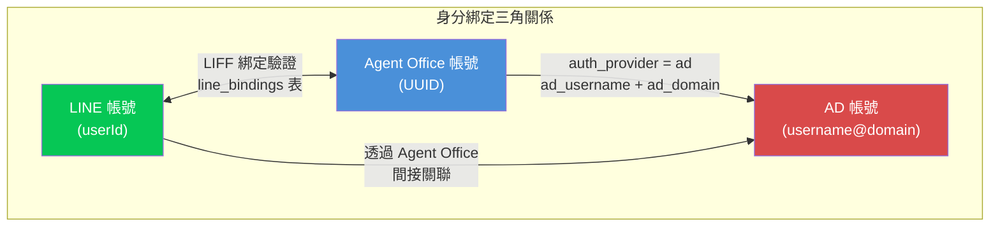
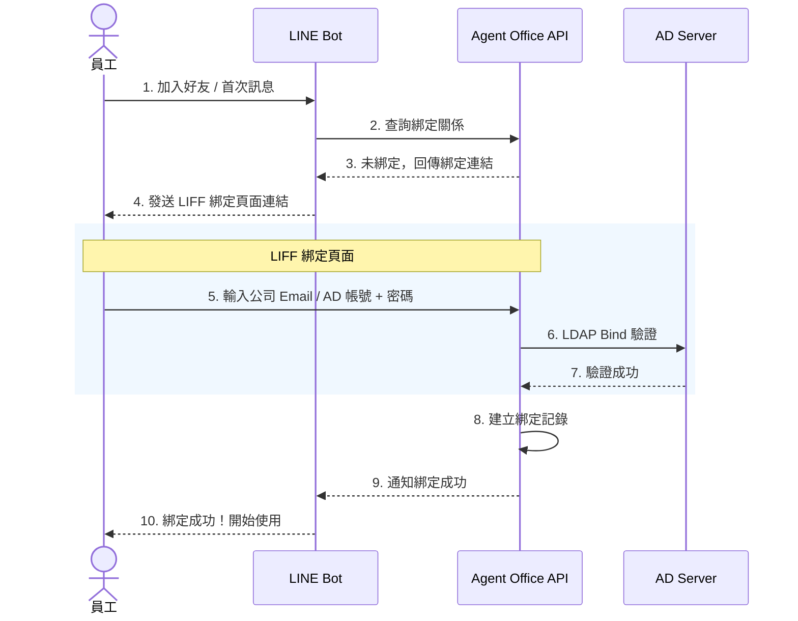
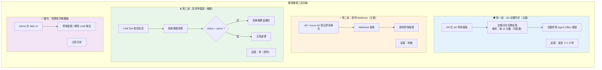
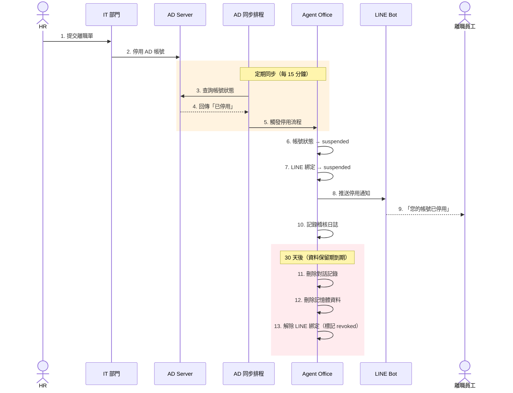
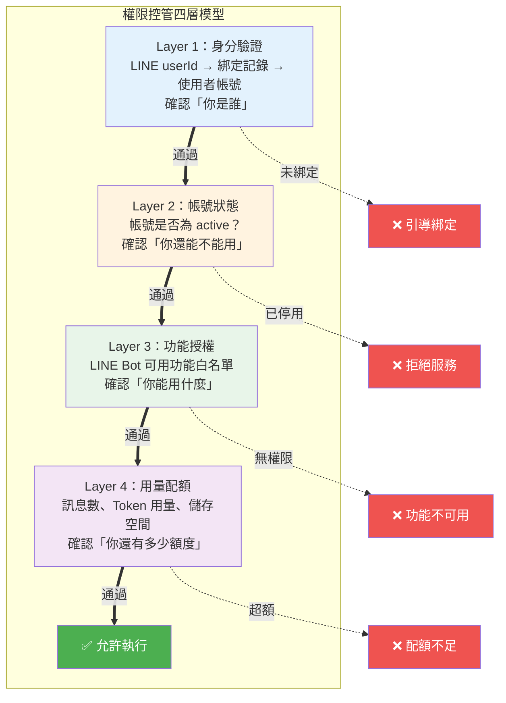
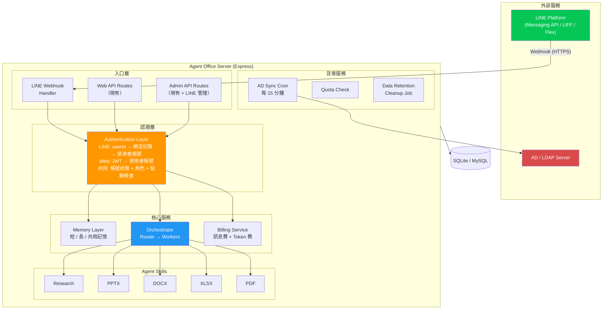
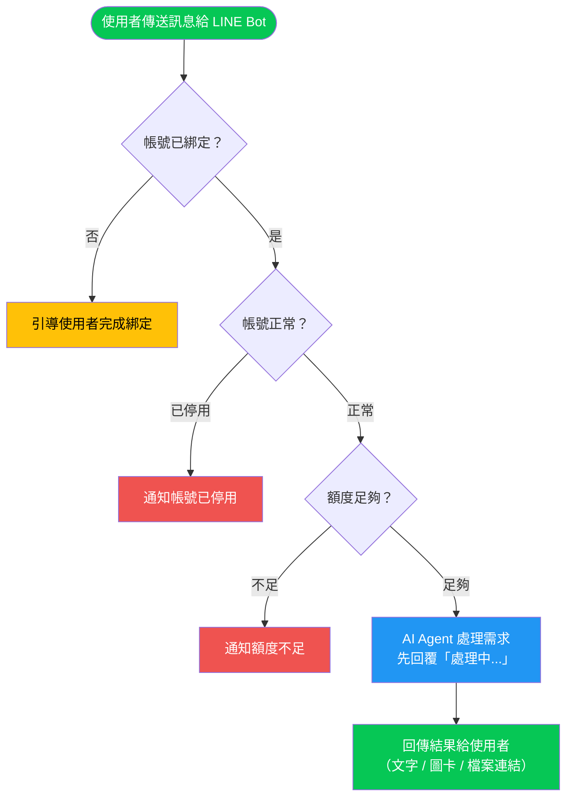
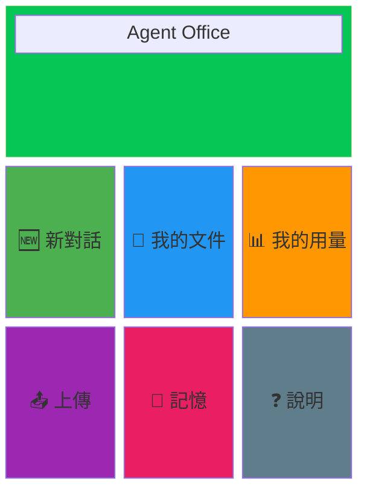
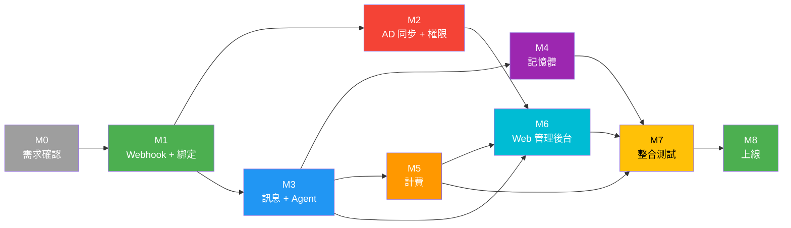

# PRD：Agent Office × LINE Bot 整合（Agent 龍蝦架構）

| 項目 | 內容 |
|------|------|
| 文件名稱 | Agent Office × LINE Bot 整合產品需求文件（PRD）|
| 專案代號 | Agent Office 第二案 |
| 版本 | v0.2（完整草案）|
| 撰寫日期 | 2026-06-02 |
| 更新紀錄 | v0.1 → v0.2：新增 AD 帳號整合細節、離職權限撤銷流程、完整權限控管架構、API 規格、安全性考量 |

---

## 1. 背景與問題陳述（Background / Problem）

- 公司已有成熟的 **Agent Office** 系統，具備多 Agent 協作引擎（Router → Worker）、SSE 即時串流、角色權限控管（admin / user / readonly）、AD / OAuth / Email 三種認證方式。
- 因此決策方向為：**將 LINE Bot 整合進 Agent Office**，而非另起爐灶。
- 整合後將同時存在 **兩個入口（Web UI + LINE Bot）** 但共用同一套後端引擎，採用 AI 個人助理方式進行溝通。
- 核心挑戰：如何讓公司既有的 **AD（Active Directory）帳號體系** 與 LINE 使用者身分安全綁定，並在人員異動時自動撤銷權限。

### 1.1 現有 LINE Bot 介面參考

下圖為現有 LINE Bot（`zhaoi_net`）的主選單與「本月用量」Flex Message 示意：

| 主選單項目 | 對應 PRD 章節 |
|-----------|--------------|
| 新對話 NEW CONVERSATION | 5.6 訊息管理 / IM |
| 上傳檔案 UPLOAD FILE | 5.7 檔案管理 |
| 我的文件 MY DOCUMENTS | 5.5 LINE Bot 管理模組 |
| 我的用量 MY USAGE | 5.2 計費模組 |
| 我的記憶 MEMORIES | 5.4 記憶體機制 |
| 說明 HELP | 5.8 輔助功能 |

### 1.2 現有 Agent Office 認證架構

目前系統支援三種認證方式，LINE Bot 整合需建立在此基礎上：

| 認證方式 | 部署模式 | 說明 |
|---------|---------|------|
| Email + Password | 全部 | bcrypt 雜湊 + JWT（7 天效期）|
| Google OAuth2 | 全部 | OAuth 第三方登入 |
| Active Directory | 內部部署 | AD 帳號 + 網域驗證 |

---

## 2. 目標（Goals）

| # | 目標 | 衡量方式 | 優先級 |
|---|------|----------|--------|
| G1 | LINE Bot 作為 Agent Office 的第二入口，共用後端引擎 | LINE 送出的請求進入同一套 Orchestrator | P0 |
| G2 | AD 帳號與 LINE 使用者安全綁定，一人一帳 | 綁定記錄存在且可查詢，不可重複綁定 | P0 |
| G3 | 人員異動（離職/調動）時自動撤銷 LINE Bot 權限 | AD 停用後 LINE Bot 於 T+N 內無法使用 | P0 |
| G4 | 完整的權限控管模型（誰能用、能用什麼、用多少）| 後台可設定、可稽核 | P0 |
| G5 | 計費併入 Agent Office，訊息量 + Token 雙軌計費 | 帳單正確反映 LINE 管道用量 | P1 |
| G6 | LINE Bot 具備長/短/共用記憶能力 | 對話可跨輪次、跨會話保留上下文 | P1 |
| G7 | 網頁端提供 LINE Bot 管理模組 | 可檢視訊息、呼叫次數與項目 | P1 |

### 非目標（Non-Goals）
- 不重建 Agent Office 既有系統架構。
- 不在本案導入其他通訊平台（Teams、Slack 等），但架構應預留擴充性。
- 不自建 AD Server，僅對接既有企業 AD。
- 不處理 LINE Official Account 的申請與審核流程（前置條件）。

---

## 3. 使用者與角色（Users / Roles）

| 角色 | 說明 | LINE Bot 互動 |
|------|------|--------------|
| 終端使用者（Employee） | 透過 LINE 與 Bot 互動的公司員工 | 直接對話 |
| Agent Office 帳號擁有者 | 綁定 LINE Bot、查看對話與用量 | 透過 Web UI 管理 |
| 部門管理者 | 管理所屬部門人員的 LINE Bot 權限與用量 | Web UI 部門儀表板 |
| 系統管理員（Admin） | 控管帳號對應、全域權限與整體用量 | Web UI 管理後台 |
| HR / IT 管理員 | 觸發人員異動流程（離職、調動） | AD / HR 系統操作 |

---

## 4. 核心架構：AD 帳號 × LINE Bot 整合（★ 重點章節）

### 4.1 身分綁定架構

**關鍵原則**：
- 一個 LINE userId 最多綁定一個 Agent Office 帳號
- 一個 Agent Office 帳號最多綁定一個 LINE userId（1:1 嚴格對應）
- AD 帳號透過現有使用者資料與 Agent Office 帳號關聯
- LINE userId 透過新建綁定記錄與 Agent Office 帳號關聯

### 4.2 綁定流程（首次使用）

**綁定方式選項**：

| 方式 | 說明 | 安全等級 | 適用場景 |
|------|------|---------|---------|
| **A. LIFF + AD 認證**（推薦）| LINE 內嵌網頁，輸入 AD 帳密驗證 | ★★★★★ | 有 AD 的企業 |
| B. LIFF + Email OTP | LINE 內嵌網頁，寄 OTP 到公司信箱 | ★★★★ | 無 AD 的企業 |
| C. 綁定碼 | Web UI 產生一次性碼，LINE 輸入驗證 | ★★★ | 管理員協助綁定 |
| D. OAuth Redirect | 跳轉 Agent Office 登入頁 | ★★★★ | 已有 OAuth 流程 |

### 4.3 離職 / 人員異動時的權限撤銷（★★ 關鍵流程）

#### 4.3.1 撤銷觸發方式（三道防線）

#### 4.3.2 停用帳號的連鎖效果

當帳號被停用時：

| 步驟 | 動作 | 影響範圍 |
|------|------|---------|
| 1 | 帳號狀態改為「停用」 | 帳號層級 |
| 2 | LINE 綁定狀態同步改為「停用」 | LINE 綁定 |
| 3 | 終止所有進行中的 Agent Sessions | 執行層級 |
| 4 | LINE Bot 發送停用通知給使用者 | 使用者體驗 |
| 5 | Web UI 登入時拒絕（現有機制已支援）| Web 登入 |
| 6 | 記錄到稽核日誌 | 稽核 |
| 7 | 通知系統管理員（可選） | 管理層 |

**停用後使用者體驗**：
> 使用者（已停用）傳訊息給 LINE Bot
> → Bot 回覆：「您的帳號已停用，如有疑問請聯繫 IT 部門。」
> → 不執行任何 Agent 操作
> → 系統記錄安全事件

#### 4.3.3 離職完整流程

#### 4.3.4 資料保留政策（建議）

| 資料類型 | 停用後保留期 | 到期處理 |
|---------|------------|---------|
| 對話記錄 | 30 天 | 封存或刪除 |
| 生成的檔案 | 30 天 | 刪除 |
| 記憶體資料 | 立即清除 | - |
| Token 用量統計 | 永久 | 保留（計費稽核用）|
| LINE 綁定記錄 | 永久 | 保留但標記為已撤銷 |
| 稽核日誌 | 永久 | 保留（合規要求）|

### 4.4 權限控管模型（Permission Model）

#### 4.4.1 權限層級架構

#### 4.4.2 功能權限矩陣

| 功能 | user | admin | readonly | LINE Bot（預設） | 可配置 |
|------|------|-------|----------|-----------------|--------|
| 新對話 / AI 問答 | ✅ | ✅ | ❌ | ✅ | ✅ |
| 生成文件（PPTX/DOCX/XLSX/PDF） | ✅ | ✅ | ❌ | ✅ | ✅ |
| 上傳檔案 | ✅ | ✅ | ❌ | ✅（限制大小）| ✅ |
| 查看自己的對話記錄 | ✅ | ✅ | ✅ | ✅ | ❌ |
| 查看用量 | ✅ | ✅ | ✅ | ✅ | ❌ |
| 管理記憶 | ✅ | ✅ | ❌ | ✅ | ✅ |
| 管理他人帳號 | ❌ | ✅ | ✅ | ❌ | ❌ |
| LINE Bot 管理後台 | ❌ | ✅ | ✅ | ❌ | ❌ |
| 研究 / 網路搜尋 | ✅ | ✅ | ❌ | 視配置 | ✅ |
| 圖表 / 視覺化 | ✅ | ✅ | ❌ | ❌（LINE 限制）| - |

#### 4.4.3 LINE Bot 專屬權限設定

管理員可在 Web UI 為每個使用者或群組設定 LINE Bot 可用功能：

| 設定項目 | 說明 | 預設值 |
|---------|------|--------|
| 可用技能 | 允許使用的 Agent 技能（研究、PPTX、DOCX 等） | 全部開啟 |
| 每日訊息上限 | 每天最多可發送的訊息數 | 100 則 |
| 檔案大小上限 | 上傳檔案的最大尺寸 | 50 MB |
| 允許上傳檔案 | 是否允許透過 LINE 上傳檔案 | 是 |
| 允許下載檔案 | 是否允許透過 LINE 取得生成的檔案 | 是 |
| 允許存取記憶 | 是否允許存取個人記憶功能 | 是 |
| Agent 協作模式 | 自動 / 僅直接模式 / 停用 | 自動 |

---

## 5. 功能需求（Functional Requirements）

### 5.1 LINE Bot 接口層（Webhook & Messaging）

- **FR-1**：實作 LINE Messaging API Webhook endpoint，接收文字、圖片、檔案訊息。
- **FR-2**：支援 Reply Token 回覆（5 秒限制）+ Push Message 非同步回覆。
- **FR-3**：長時間處理的 Agent 任務，先回覆「處理中...」，完成後 Push 結果。
- **FR-4**：支援 Flex Message 富格式回覆（用量報表、檔案清單等）。
- **FR-5**：支援 Rich Menu（主選單），對應功能按鈕。

### 5.2 計費模組（Billing）

- **FR-6**：LINE Bot 訊息發送採雙軌計費：
  - **訊息費**：依 LINE Messaging API 方案計算（免費額度 200 則/月、中型 3,000 則/月）。
  - **Token 費**：依 AI Agent 實際消耗的 Token 計費（沿用現有機制）。
- **FR-7**：兩種費用**併入 Agent Office 帳單**統一計收，在用量頁面區分管道來源（Web / LINE）。
- **FR-8**：即時用量追蹤，可在 LINE Bot 查詢「我的用量」。
- **FR-9**：配額耗盡時通知使用者（LINE 推播 + Web UI 提示），並優雅降級（拒絕新請求但可查看歷史）。

### 5.3 帳號對應與權限控管（Account Mapping & Access Control）★ 核心

- **FR-10**：支援 LIFF（LINE Front-end Framework）綁定頁面，使用者可透過 AD 帳號或 Email + OTP 完成身分綁定。
- **FR-11**：綁定關係為 1:1（一個 LINE userId 對應一個 Agent Office 帳號），不可重複綁定。
- **FR-12**：管理員可在 Web UI 查看所有綁定關係，並可手動解除綁定。
- **FR-13**：支援 AD 定期同步排程，偵測帳號停用/刪除並自動停用對應 LINE 權限。
- **FR-14**：同步頻率可配置（建議預設 15 分鐘），支援手動觸發立即同步。
- **FR-15**：每次 LINE Bot 收到訊息時，檢查帳號是否為 active 狀態，非 active 則拒絕服務。
- **FR-16**：帳號停用時自動清除敏感資料（記憶體），但保留對話記錄至保留期限到期。
- **FR-17**：所有綁定/解綁/停用操作記錄到稽核日誌。

### 5.4 記憶體機制（Memory）

- **FR-18**：LINE Bot 具備三層記憶體：

| 記憶類型 | 作用範圍 | 生命週期 | 範例 |
|---------|---------|---------|------|
| **短期記憶** | 單一對話 | 對話結束即清除 | 當前對話上下文 |
| **長期記憶** | 單一使用者 | 持久（除非刪除）| 使用者偏好、常用格式 |
| **共用記憶** | 同組織/部門 | 持久（Admin 管理）| 公司模板、SOP、知識庫 |

- **FR-19**：長期記憶 LINE / Web 共用同一份記憶，不分管道。
- **FR-20**：共用記憶由管理員在 Web UI 維護，可設定共用範圍（全公司 / 部門 / 群組）。
- **FR-21**：使用者可透過 LINE Bot「我的記憶」功能查看/刪除個人長期記憶。
- **FR-22**：帳號停用時，個人長期記憶立即標記為不可存取，30 天後永久刪除。

### 5.5 網頁端 LINE Bot 管理模組（Web Management）

- **FR-23**：Admin 後台新增「LINE Bot」管理頁面，包含：
  - **綁定管理**：查看所有 LINE ↔ Agent Office 帳號對應，支援搜尋/篩選/解綁。
  - **訊息監控**：查看 LINE Bot 通訊往來的訊息摘要（不含完整內容，除非需稽核）。
  - **用量統計**：按使用者/部門/時間區間統計呼叫次數、Token 消耗、訊息數。
  - **功能使用分析**：統計各技能（PPTX、DOCX 等）的呼叫頻次。
- **FR-24**：使用者個人頁面新增「LINE Bot」tab：
  - 綁定狀態（已綁定 / 未綁定）
  - 綁定/解綁操作
  - LINE 管道的對話歷史
  - LINE 管道的用量明細

### 5.6 訊息管理 / IM（Messaging / IM）

- **FR-25**：LINE Bot 對話記錄與 Web UI 對話記錄分開管理但同一帳號下可查閱。
- **FR-26**：LINE 對話與 Web 對話以管道標記區分。
- **FR-27**：LINE Bot 訊息支援以下類型的輸入：純文字、圖片（附 OCR）、檔案（PDF/Office）。
- **FR-28**：LINE Bot 輸出支援：純文字、Flex Message、檔案下載連結（短效 Signed URL）。

### 5.7 檔案管理（File Management）

- **FR-29**：使用者可透過 LINE 上傳檔案，存入 Agent Office 的使用者專屬目錄。
- **FR-30**：Agent 生成的檔案可透過 LINE Push Message 發送下載連結。
- **FR-31**：下載連結使用 Signed URL，有效期 24 小時，過期需從 Web UI 重新取得。
- **FR-32**：檔案大小限制沿用 LINE Messaging API 限制（圖片 10MB、檔案 300MB）。

### 5.8 輔助功能（Help & Onboarding）

- **FR-33**：首次使用引導流程（Onboarding），引導完成帳號綁定。
- **FR-34**：「說明」功能提供常見問題、可用指令列表、聯繫管理員方式。
- **FR-35**：錯誤訊息人性化，避免暴露技術細節。

---

## 6. 系統架構（System Architecture）

### 6.1 整體架構圖

### 6.2 LINE 訊息處理流程

---

## 7. API 設計（API Endpoints）

### 7.1 LINE Webhook

| Method | Path | 說明 |
|--------|------|------|
| POST | `/api/line/webhook` | LINE Messaging API Webhook 接收端 |

### 7.2 綁定管理

| Method | Path | 說明 | 權限 |
|--------|------|------|------|
| POST | `/api/line/bind` | LIFF 綁定（AD 認證或 Email OTP） | 未綁定的 LINE 使用者 |
| DELETE | `/api/line/bind` | 使用者自行解綁 | 已綁定的 LINE 使用者 |
| GET | `/api/line/bind/status` | 查詢綁定狀態 | LINE 使用者 |

### 7.3 使用者端 API（LINE 觸發）

| Method | Path | 說明 | 權限 |
|--------|------|------|------|
| GET | `/api/line/conversations` | 取得 LINE 對話列表 | user |
| GET | `/api/line/usage` | 取得 LINE 管道用量 | user |
| GET | `/api/line/memories` | 取得個人記憶 | user |
| DELETE | `/api/line/memories/:id` | 刪除個人記憶 | user |
| GET | `/api/line/files` | 取得生成的檔案列表 | user |
| GET | `/api/line/files/:id/download` | 取得檔案下載 Signed URL | user |

### 7.4 管理員 API

| Method | Path | 說明 | 權限 |
|--------|------|------|------|
| GET | `/api/admin/line/bindings` | 查看所有綁定關係 | admin, readonly |
| DELETE | `/api/admin/line/bindings/:id` | 強制解除綁定 | admin |
| GET | `/api/admin/line/stats` | LINE Bot 整體統計 | admin, readonly |
| GET | `/api/admin/line/messages` | 訊息監控（摘要） | admin |
| POST | `/api/admin/line/sync-ad` | 手動觸發 AD 同步 | admin |
| GET | `/api/admin/line/sync-logs` | AD 同步記錄 | admin, readonly |
| GET | `/api/admin/line/permissions/:userId` | 查看使用者 LINE 權限 | admin, readonly |
| PUT | `/api/admin/line/permissions/:userId` | 設定使用者 LINE 權限 | admin |

---

## 8. 安全性考量（Security Considerations）

### 8.1 LINE Webhook 安全

| 項目 | 措施 |
|------|------|
| 請求驗證 | 驗證 X-Line-Signature（HMAC-SHA256） |
| HTTPS | 強制 TLS 1.2+ |
| IP 白名單 | 可選，限制 LINE Platform IP 範圍 |
| Replay Attack | 檢查 Event timestamp（容許 5 分鐘偏差）|

### 8.2 LIFF 綁定頁面安全

| 項目 | 措施 |
|------|------|
| LIFF Token 驗證 | 透過 LINE SDK 驗證 LIFF Access Token |
| AD 認證 | LDAPS（加密 LDAP），不在前端暴露密碼 |
| 防暴力破解 | 綁定嘗試次數限制（5 次/15 分鐘），沿用現有 rate limiter |
| CSRF 防護 | LIFF 頁面使用 state token |

### 8.3 資料安全

| 項目 | 措施 |
|------|------|
| LINE userId 儲存 | 加密儲存（或至少 hashed index） |
| 對話內容 | 與 Web 管道同等級加密 |
| 檔案傳輸 | Signed URL + 短效 Token |
| 記憶體資料 | 帳號停用時立即不可存取 |
| 敏感操作 | 全部記錄到稽核日誌 |

### 8.4 Prompt Injection 防護

沿用現有 Agent Office 的 5 層沙盒防禦模型，LINE 訊息視為不可信輸入：
1. 輸入清洗（sanitize LINE message content）
2. Agent 工具白名單/黑名單限制
3. 工作目錄隔離（每使用者、每對話獨立）
4. Agent 執行逾時保護（3 分鐘）
5. 安全事件記錄

---

## 9. LINE Bot 特殊 UX 考量

### 9.1 回覆格式適配

LINE 與 Web UI 的主要差異：

| 面向 | Web UI | LINE Bot | 處理方式 |
|------|--------|----------|---------|
| Markdown | 完整支援 | 不支援 | 轉換為純文字 + Flex Message |
| 圖表（Recharts/ECharts） | 即時渲染 | 不支援即時渲染 | 轉為圖片（Server-side render → 傳送圖片）|
| Mermaid / Mindmap | 即時渲染 | 不支援 | 轉為圖片或省略 |
| 檔案下載 | 直接下載 | Signed URL 連結 | Push Message 附連結 |
| 串流顯示 | SSE 逐字顯示 | 不支援串流 | 等待完成後一次發送 |
| 訊息長度 | 無限制 | 5,000 字元 | 自動分段發送 |

### 9.2 Rich Menu 設計

### 9.3 錯誤處理

| 錯誤情境 | 使用者看到的訊息 | 系統行為 |
|---------|----------------|---------|
| 未綁定帳號 | 「請先完成帳號綁定，點擊連結開始：{LIFF URL}」 | 記錄 follow event |
| 帳號已停用 | 「您的帳號已停用，如有疑問請聯繫 IT 部門（分機 XXXX）」 | 記錄安全事件 |
| 配額不足 | 「本月用量已達上限，請聯繫管理員或等待下月重置」 | 記錄配額超額事件 |
| Agent 處理逾時 | 「處理時間較長，請稍候。若持續未回覆請重新發送」 | 記錄逾時事件 |
| 系統錯誤 | 「系統暫時無法處理，請稍後再試」 | 記錄錯誤 + 通知管理員 |

---

## 10. 待釐清事項（Open Questions）

| # | 問題 | 需確認對象 | 優先級 | 備註 |
|---|------|-----------|--------|------|
| Q1 | 「LDP／情訊管理」正確名稱與定義（疑為 IM 訊息管理或 IDP） | 交辦人 | P0 | 影響功能範圍 |
| Q2 | 計費級距確認：200 則/3,000 則對應的方案名稱與實際單價 | 交辦人/業務 | P1 | 影響計費模組 |
| Q3 | Token 計價方式：是否沿用現有 markup 倍率？ | 業務/財務 | P1 | |
| Q4 | AD 同步方式偏好：定期輪詢 vs Azure AD Webhook？ | IT | P0 | 取決於企業 AD 版本 |
| Q5 | AD 同步頻率需求：15 分鐘是否足夠？還是需要即時？ | IT/資安 | P0 | 影響安全性 SLA |
| Q6 | 三種記憶體的儲存上限與保存期限 | 技術/交辦人 | P1 | |
| Q7 | 共用記憶的「共用」範圍：同公司 / 同部門 / 自定義群組？ | 交辦人 | P1 | 需要部門資料來源 |
| Q8 | 離職後資料保留期限（建議 30 天）是否符合法規要求？ | 法務/資安 | P1 | 可能有勞基法或個資法要求 |
| Q9 | LINE Official Account 類型：Verified / Unverified？ | 業務 | P0 | 影響 Push Message 費用 |
| Q10 | LIFF 綁定頁面是否需要支援多語系？ | 交辦人 | P2 | |
| Q11 | 是否需要支援 LINE 群組（Group）對話？ | 交辦人 | P1 | 群組情境的帳號對應更複雜 |
| Q12 | 圖表/視覺化內容在 LINE 的處理方式：轉圖片 or 省略？ | 技術/交辦人 | P2 | Server-side render 有額外成本 |
| Q13 | 是否需要 LINE Bot 支援語音訊息（Speech-to-Text）？ | 交辦人 | P2 | 需額外 STT 服務 |

---

## 11. 里程碑規劃（Milestones）

| 階段 | 內容 | 前置條件 | 預估產出 |
|------|------|---------|---------|
| **M0** | 需求確認與技術調研 | - | 確認 Q1-Q13、LINE OA 申請、AD 連線測試 |
| **M1** | LINE Webhook + 基礎綁定 | M0 完成 | Webhook 接收、LIFF 綁定頁面 |
| **M2** | AD 同步 + 權限控管 | M1 完成 | AD sync cron、停用連鎖、請求時驗證 |
| **M3** | 訊息處理 + Agent 整合 | M1 完成 | LINE 訊息 → Orchestrator → 回覆 |
| **M4** | 記憶體機制 | M3 完成 | 長/短/共用記憶、Web UI 管理 |
| **M5** | 計費整合 | M3 完成 | 雙軌計費、用量查詢 |
| **M6** | Web 管理後台 | M2, M3, M5 完成 | Admin LINE Bot 管理頁面 |
| **M7** | 整合測試 + UAT | M1-M6 完成 | 測試報告、效能調校 |
| **M8** | 上線 + 監控 | M7 通過 | Production 部署、監控儀表板 |

### 里程碑依賴關係

---

## 12. 風險評估（Risk Assessment）

| 風險 | 影響 | 機率 | 緩解策略 |
|------|------|------|---------|
| AD 同步延遲導致離職員工仍可使用 | 高（資安） | 中 | 三道防線（sync + webhook + 請求時驗證）|
| LINE Messaging API 費率變動 | 中（成本） | 低 | 計費模組設計為可配置 |
| LINE Platform 停機影響服務 | 中（可用性） | 低 | Web UI 作為備援入口 |
| LIFF 綁定流程使用者體驗不佳 | 中（導入率） | 中 | 提供多種綁定方式、onboarding 引導 |
| 大量同時訊息造成 Agent 排隊 | 高（體驗） | 中 | 訊息佇列 + 並行處理 + 優先級 |
| 個資法合規風險（對話記錄保存） | 高（法律） | 中 | 明確資料保留政策 + 使用者同意書 |

---

## 13. 成功指標（Success Metrics）

| 指標 | 目標值 | 量測方式 |
|------|--------|---------|
| LINE Bot 綁定率 | >80% 目標使用者 | 綁定數 / 目標使用者數 |
| 帳號停用後最大延遲 | <1 小時 | AD 同步記錄時間差 |
| LINE Bot 回覆時間（P95） | <30 秒 | 送達時間 - 建立時間 |
| 月活躍使用者 | 遞增趨勢 | 最後活躍時間統計 |
| 錯誤率 | <1% | 錯誤事件 / 總事件 |

---

## 附錄 A：名詞對照表

| 縮寫/名詞 | 全稱 | 說明 |
|-----------|------|------|
| AD | Active Directory | 微軟目錄服務，企業帳號管理 |
| LDAP | Lightweight Directory Access Protocol | AD 查詢協定 |
| LIFF | LINE Front-end Framework | LINE 內嵌 WebView 框架 |
| Flex Message | - | LINE 富格式訊息（JSON 定義排版）|
| Rich Menu | - | LINE Bot 底部固定選單 |
| Push Message | - | LINE Bot 主動推送訊息（計費）|
| Reply Message | - | LINE Bot 被動回覆（免費，但有 5 秒限制）|
| Signed URL | - | 附帶簽名的臨時下載連結 |
| SSE | Server-Sent Events | 伺服器推送事件 |
| Orchestrator | - | Agent Office 多 Agent 協作引擎 |
