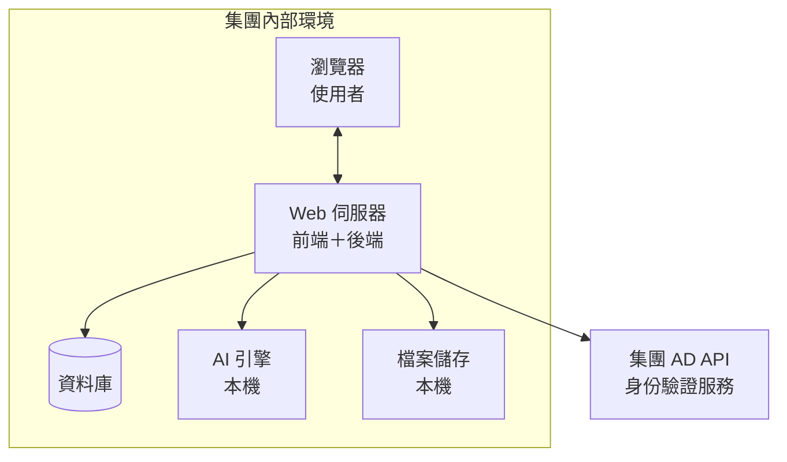
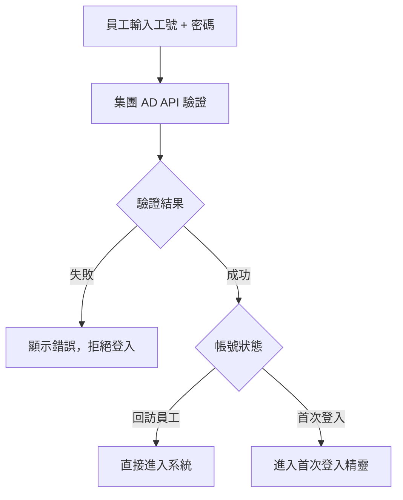
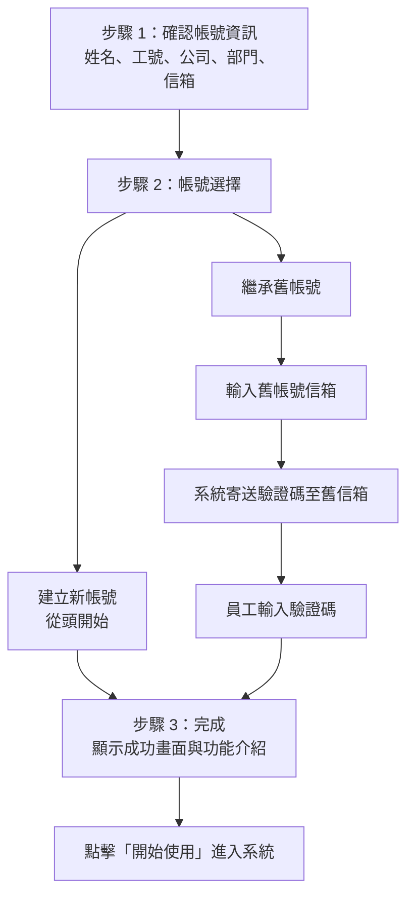
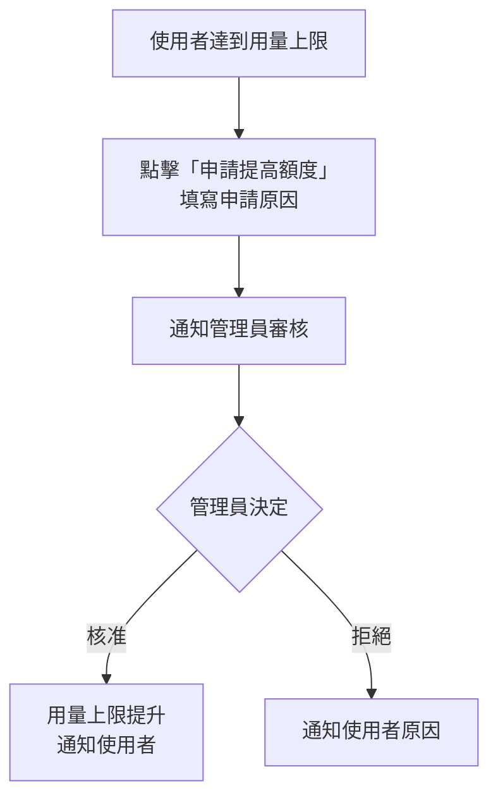
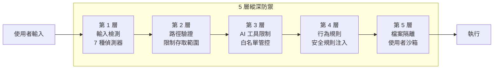
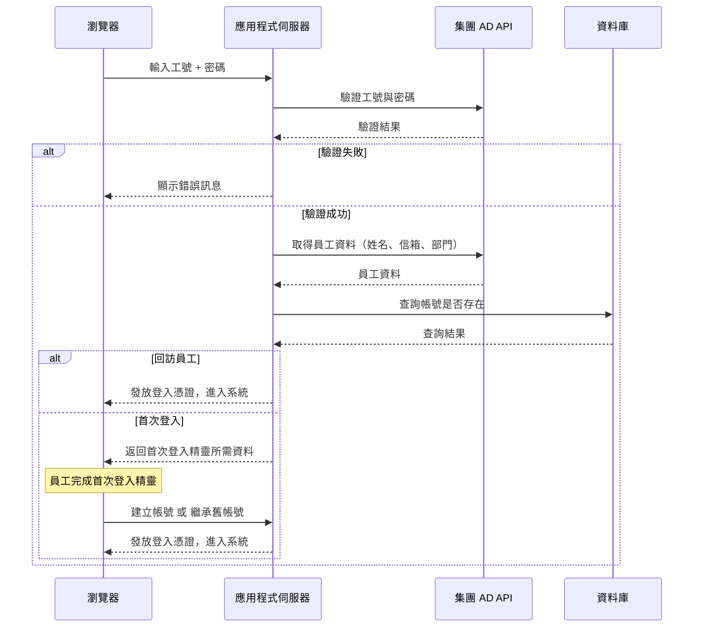

# AI Agents Office — 系統設計文件（強茂集團版）

> 版本：1.1｜日期：2026-05-12

---

## 1. 文件目的

本文件說明 AI Agents Office 強茂集團內部部署版的系統架構設計，涵蓋認證機制、組織管理、帳號權限與操作流程。

---

## 2. 系統架構總覽

### 2.1 部署架構

AI Agents Office 採用**本機部署**架構，所有元件運行在客戶自有環境中：

**資料不離開集團環境**——所有運算、儲存、AI 推理皆在本機完成。

### 2.2 系統組成

| 元件 | 功能 | 說明 |
|------|------|------|
| Web 前端 | 使用者介面 | 對話界面、檔案管理、管理後台 |
| API 後端 | 業務邏輯 | 請求處理、安全檢查、Agent 協調 |
| AI 引擎 | 智慧生成 | 自然語言理解、內容生成 |
| 資料庫 | 資料持久化 | 使用者帳號、對話紀錄、檔案記錄 |
| 檔案儲存 | 文件管理 | 生成文件、上傳檔案、版本備份 |
| 集團 AD API | 身份驗證 | 員工工號驗證、人員資料同步 |

---

## 3. 認證架構

### 3.1 AD 工號登入

所有員工使用 **AD 工號 + 密碼** 登入，系統透過集團 AD API 進行身份驗證：

**AD 密碼安全說明：** 員工密碼僅於驗證時傳遞至集團 AD API，本系統不儲存任何 AD 密碼。

### 3.2 首次登入精靈

員工初次以 AD 工號登入時，系統引導完成帳號設定：

**帳號繼承說明：**
- 如員工先前已有系統帳號，可將歷史對話、設定合併至 AD 帳號
- 繼承後，帳號信箱自動更新為 AD 信箱，資料完整保留

### 3.3 管理員登入

系統管理員使用獨立的 Email + 密碼登入，入口位於登入頁面底部，一般員工不會看到此入口。

### 3.4 支援的集團公司

| 公司代號 | 公司名稱 |
|----------|----------|
| PANJIT | PANJIT（台灣）|
| PYNMAX | PYNMAX（璟茂）|
| WXPJ | WXPJ（無錫強茂）|
| PJWS | PJWS（強茂深圳）|
| GDPJ | GDPJ（蘇州群鑫）|
| PJXZ | PJXZ（強茂徐州）|
| PJSD | PJSD（山東強茂）|

---

## 4. 帳號角色與權限

### 4.1 三種角色

| 角色 | 說明 | 帳號來源 |
|------|------|----------|
| **一般使用者** | 使用 AI 文件生成、AI 助理等核心功能 | AD 工號首次登入後自動建立 |
| **唯讀管理員** | 可瀏覽管理後台與組織圖，但不能修改任何設定 | 管理員手動指派 |
| **管理員** | 完整管理權限 | 系統初始設定 |

### 4.2 各角色功能對照

| 功能 | 一般使用者 | 唯讀管理員 | 管理員 |
|------|:---------:|:---------:|:------:|
| AI 文件生成 | ✅ | ✅ | ✅ |
| AI 助理 | ✅ | ✅ | ✅ |
| 個人檔案管理 | ✅ | ✅ | ✅ |
| 組織圖瀏覽 | ❌ | ✅ | ✅ |
| 管理後台（唯讀）| ❌ | ✅ | ✅ |
| 使用者管理 | ❌ | ❌ | ✅ |
| 額度調整 | ❌ | ❌ | ✅ |
| 系統設定 | ❌ | ❌ | ✅ |

---

## 5. 組織圖功能

### 5.1 功能說明

集團組織圖提供視覺化的人員架構瀏覽，讓管理層與 HR 快速了解各子公司人員配置：

- 依公司切換分頁（7 間子公司）
- 顯示部門階層與人員配置
- 支援展開 / 收合節點
- 顯示每位員工的姓名、工號、部門

### 5.2 存取路徑

| 角色 | 路徑 |
|------|------|
| 管理員 / 唯讀管理員 | 側邊導覽列 →「組織圖」|
| 一般使用者 | 無法存取 |

### 5.3 資料來源

組織圖資料直接來自集團 AD，透過 AD API 即時讀取，無需手動維護人員資料。

---

## 6. 額度申請流程

員工用量達到上限時，可透過系統內建流程申請提高額度：

管理員可在後台「額度申請」頁面統一處理所有待審核申請。

---

## 7. 安全架構

### 7.1 多層防禦模型

### 7.2 AD 認證安全

| 項目 | 說明 |
|------|------|
| 密碼不儲存 | AD 密碼僅於驗證時傳遞，不儲存於本系統 |
| 工號唯一性 | 以「工號 + 公司代號」複合唯一鍵管理帳號，同工號在不同公司為獨立帳號 |
| 首次登入憑證 | 首次登入暫時憑證效期 30 分鐘，過期需重新登入 |
| 繼承驗證碼 | 帳號繼承驗證碼效期 30 分鐘，最多嘗試 5 次 |

### 7.3 管理員入口保護

- 管理員登入入口不顯示於一般員工介面
- 僅白名單帳號可使用此入口
- 一般員工嘗試以非 AD 方式登入，系統會拒絕並提示使用 AD 工號

### 7.4 認證與存取控制

| 功能 | 說明 |
|------|------|
| AD 工號認證 | 透過集團 AD API 驗證，密碼不落地 |
| 登入保護 | 連續失敗自動鎖定，防止暴力破解 |
| 請求限速 | 每分鐘 30 次，防止濫用 |
| Token 效期 | 登入憑證 7 天後自動過期 |
| 角色控管 | 三級權限，各自存取範圍明確隔離 |

---

## 8. 使用者介面

### 8.1 登入頁面

員工以公司選擇 + 工號 + 密碼登入，頁面底部提供管理員專用入口（一般員工不可見）。

### 8.2 側邊導覽列

唯讀管理員與管理員在側邊欄額外看到：

- **組織圖**：直接進入集團人員架構頁面
- **管理後台**：進入管理員介面

### 8.3 管理後台（唯讀管理員）

唯讀管理員可查閱但無法修改：

| 可查閱 | 不可操作 |
|--------|---------|
| 所有使用者列表 | 新增 / 編輯 / 停用使用者 |
| Token 用量統計 | 調整額度 |
| 集團組織圖 | 任何設定變更 |
| 額度申請列表 | 核准 / 拒絕申請 |

---

## 9. 部署設定

### 9.1 必要環境變數

| 變數 | 說明 |
|------|------|
| `AD_API_URL` | 集團 AD API 端點 |
| `AD_API_KEY` | AD API 金鑰 |
| `EMAIL_LOGIN_WHITELIST` | 管理員白名單信箱（逗號分隔）|
| `RESEND_API_KEY` | 寄送帳號繼承驗證碼使用 |
| `EMAIL_FROM` | 驗證碼寄件地址 |

### 9.2 環境需求

| 項目 | 最低需求 | 建議配置 |
|------|----------|----------|
| 作業系統 | Windows 10+ / Linux | — |
| CPU | 4 核心 | 8 核心以上 |
| 記憶體 | 8 GB | 16 GB 以上 |
| 磁碟空間 | 20 GB | 100 GB SSD |
| 網路 | 可連至集團 AD API | 穩定內網連線 |

---

## 10. 資料流：AD 登入全流程

