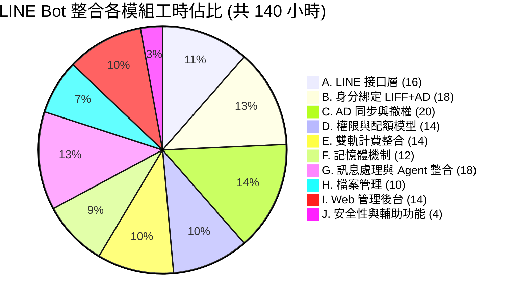
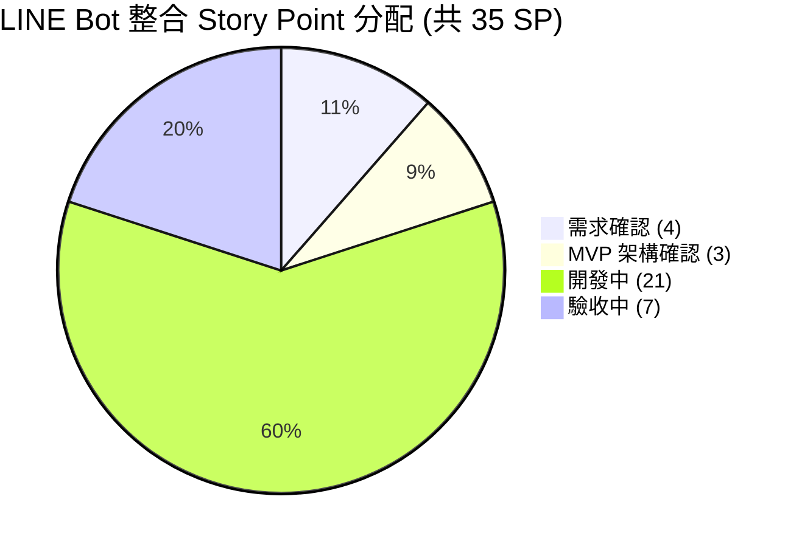

# AI Agents Office — LINE Bot 整合模組工時與 Story Point 估算

本文件為《[PRD-LINE-Bot-Integration-v0.2.md](PRD-LINE-Bot-Integration-v0.2.md)》LINE Bot 整合模組的工時與 Story Point 估算。本模組將 LINE Bot 整合為 AI Agents Office 的第二入口，與 Web UI 共用同一套後端引擎（Orchestrator、AD 認證、角色權限、計費），核心為 **AD 帳號 × LINE 身分安全綁定** 與 **人員異動時自動撤銷權限**。

> 對應 PRD：PRD-LINE-Bot-Integration-v0.2.md（v0.2 完整草案）
> 本估算以 **PRD 第 4 節核心架構（AD × LINE 綁定、三道防線撤權、四層權限模型）** 與 **第 5 節功能需求 FR-1～FR-35** 為範圍前提；不含「非目標」項目（重建既有架構、其他通訊平台、自建 AD、LINE OA 申請審核）。

---

## 一、技術模組

| 層級 | 技術 |
|------|------|
| **後端框架** | Express 5 + TypeScript（沿用既有 Orchestrator / SSE / 沙盒） |
| **前端框架** | Next.js 15 (App Router) + React 19（LIFF 綁定頁 + Admin 管理頁） |
| **LINE 平台** | Messaging API（Webhook / Reply / Push）、Flex Message、Rich Menu、LIFF |
| **認證機制** | 沿用現有 JWT + AD（LDAPS Bind）單一登入 |
| **身分綁定** | line_bindings 表（LINE userId ↔ Agent Office 帳號，1:1） |
| **資料庫** | MySQL 8.x (mysql2/promise) |
| **背景服務** | AD 同步 Cron（每 15 分鐘，可配置）、配額檢查、資料保留清理 |
| **計費** | 雙軌計費（LINE 訊息費 + AI Token 費），併入現有帳單 |

---

## 二、核心功能模組 (10 大模組)

| 模組 | 複雜度 | 說明 |
|------|--------|------|
| **A. LINE 接口層（Webhook & Messaging）** | 高 | Webhook 接收（簽章驗證）、Reply Token（5 秒）+ Push 非同步、「處理中…」先回後推、Flex Message、Rich Menu |
| **B. 身分綁定（LIFF + AD 認證）** | 高 | LIFF 綁定頁、AD LDAPS Bind 驗證、1:1 綁定記錄、自行解綁、綁定狀態查詢 |
| **C. AD 同步與權限撤銷（三道防線）** | 高 | AD 同步排程、停用 Webhook、請求時驗證、停用連鎖效果、稽核日誌 |
| **D. 權限控管與配額模型** | 中高 | 四層檢查（身分→狀態→功能→配額）、LINE Bot 功能白名單、每日訊息/檔案/技能限制 |
| **E. 雙軌計費整合** | 中高 | LINE 訊息費 + Token 費計算、管道來源區分（Web/LINE）、配額耗盡優雅降級 |
| **F. 記憶體機制（短/長/共用）** | 中 | 短期（單對話）、長期（LINE/Web 共用）、共用記憶（部門/群組）、我的記憶查刪 |
| **G. 訊息處理與 Agent 整合** | 高 | LINE → Orchestrator 串接、回覆格式適配（Markdown→純文字/Flex、圖表轉圖、5,000 字分段） |
| **H. 檔案管理（上傳/下載）** | 中 | LINE 上傳存入使用者目錄、生成檔案 Push、Signed URL（24h）下載 |
| **I. 網頁端 LINE Bot 管理後台** | 中高 | 綁定管理、訊息監控、用量/功能統計、使用者個人 LINE tab |
| **J. 安全性與輔助功能** | 中 | Webhook 簽章/Replay 防護、LIFF Token、Prompt Injection 沿用、Onboarding、人性化錯誤 |

---

## 三、功能模組說明

### A. LINE 接口層（Webhook & Messaging）
| 功能項目 | 說明 |
|----------|------|
| Webhook 接收 | `/api/line/webhook` 接收文字/圖片/檔案訊息（FR-1） |
| 回覆機制 | Reply Token 即時回覆（5 秒限制）+ Push Message 非同步回覆（FR-2） |
| 長任務處理 | 先回「處理中…」，Agent 完成後 Push 結果（FR-3） |
| Flex Message | 富格式回覆（用量報表、檔案清單等）（FR-4） |
| Rich Menu | 主選單按鈕對應各功能（FR-5、PRD 9.2） |

### B. 身分綁定（LIFF + AD 認證）
| 功能項目 | 說明 |
|----------|------|
| LIFF 綁定頁 | LINE 內嵌網頁，輸入公司 Email / AD 帳密（FR-10、PRD 4.2） |
| AD 驗證 | LDAPS Bind 驗證，密碼不在前端暴露 |
| 1:1 綁定 | 一 LINE userId ↔ 一 Agent Office 帳號，不可重複綁定（FR-11） |
| 解綁/查詢 | 使用者自行解綁、查詢綁定狀態（API 7.2） |

### C. AD 同步與權限撤銷（三道防線）
| 功能項目 | 說明 |
|----------|------|
| 定期同步 | AD 同步排程偵測停用/刪除（預設 15 分鐘，可配置、可手動觸發）（FR-13、FR-14） |
| 即時撤權 | 停用 Webhook 接收（秒級，視企業 AD 版本）（PRD 4.3.1 L2） |
| 請求時驗證 | 每則訊息檢查帳號 active 狀態，非 active 拒絕（FR-15） |
| 停用連鎖 | 帳號停用→LINE 綁定停用→終止 Sessions→推播通知→清記憶→稽核（PRD 4.3.2） |
| 稽核日誌 | 綁定/解綁/停用全部記錄（FR-17） |

### D. 權限控管與配額模型
| 功能項目 | 說明 |
|----------|------|
| 四層檢查 | 身分驗證→帳號狀態→功能授權→用量配額（PRD 4.4.1） |
| 功能白名單 | 可配置 LINE Bot 可用技能、協作模式（PRD 4.4.3） |
| 配額限制 | 每日訊息上限、檔案大小上限、可否上傳/下載/存取記憶 |

### E. 雙軌計費整合
| 功能項目 | 說明 |
|----------|------|
| 訊息費 | 依 LINE Messaging API 方案計（免費 200 / 中型 3,000 則/月）（FR-6） |
| Token 費 | 沿用現有 Token 計費機制 |
| 帳單併計 | 併入 Agent Office 帳單，用量頁區分 Web / LINE 管道（FR-7、FR-8） |
| 優雅降級 | 配額耗盡 LINE 推播 + Web 提示，拒新請求但可查歷史（FR-9） |

### F. 記憶體機制（短/長/共用）
| 功能項目 | 說明 |
|----------|------|
| 短期記憶 | 單一對話上下文，對話結束清除（FR-18） |
| 長期記憶 | 單一使用者，LINE / Web 共用同一份（FR-19） |
| 共用記憶 | 組織/部門知識庫，Admin 維護、可設共用範圍（FR-20） |
| 我的記憶 | LINE Bot 查看/刪除個人長期記憶；停用後 30 天刪除（FR-21、FR-22） |

### G. 訊息處理與 Agent 整合
| 功能項目 | 說明 |
|----------|------|
| Orchestrator 串接 | LINE 訊息進入同一套多 Agent 引擎（PRD 6.2） |
| 輸入支援 | 純文字、圖片（OCR）、檔案（PDF/Office）（FR-27） |
| 格式適配 | Markdown→純文字/Flex、圖表 Server-side render 轉圖、5,000 字自動分段（PRD 9.1） |
| 對話標記 | LINE / Web 對話以管道區分、分開管理同帳號可查（FR-25、FR-26） |

### H. 檔案管理（上傳/下載）
| 功能項目 | 說明 |
|----------|------|
| 上傳 | LINE 上傳存入使用者專屬沙箱目錄（FR-29） |
| 下載連結 | 生成檔案以 Push 發送 Signed URL（有效 24h）（FR-30、FR-31） |
| 大小限制 | 沿用 LINE 限制（圖片 10MB、檔案 300MB）（FR-32） |

### I. 網頁端 LINE Bot 管理後台
| 功能項目 | 說明 |
|----------|------|
| 綁定管理 | 查看所有 LINE ↔ 帳號對應，搜尋/篩選/強制解綁（FR-23） |
| 訊息監控 | LINE 訊息摘要監控（合規） |
| 用量統計 | 按使用者/部門/時間統計呼叫、Token、訊息數、技能頻次 |
| 個人 tab | 使用者頁面 LINE Bot tab：綁定狀態、對話歷史、用量明細（FR-24） |

### J. 安全性與輔助功能
| 功能項目 | 說明 |
|----------|------|
| Webhook 安全 | X-Line-Signature (HMAC-SHA256) 驗證、Replay 防護（PRD 8.1） |
| LIFF 安全 | LIFF Token 驗證、綁定嘗試次數限制、CSRF state token（PRD 8.2） |
| 注入防護 | LINE 訊息視為不可信，沿用 5 層沙盒防禦（PRD 8.4） |
| 輔助功能 | Onboarding 引導綁定、說明/FAQ、人性化錯誤訊息（FR-33～35） |

---

## 四、工時總計

### 工時分佈圖

| 模組 | 小時 |
|------|------|
| A. LINE 接口層（Webhook & Messaging） | 16 |
| B. 身分綁定（LIFF + AD 認證） | 18 |
| C. AD 同步與權限撤銷（三道防線） | 20 |
| D. 權限控管與配額模型 | 14 |
| E. 雙軌計費整合 | 14 |
| F. 記憶體機制（短/長/共用） | 12 |
| G. 訊息處理與 Agent 整合 | 18 |
| H. 檔案管理（上傳/下載） | 10 |
| I. 網頁端 LINE Bot 管理後台 | 14 |
| J. 安全性與輔助功能 | 4 |
| **合計** | **140 小時** |

---

### 專案 Story Point 分配

本模組總計 **35 SP**（1 SP = NT$20,000，合計 NT$700,000），各階段分配如下：

| 階段 | SP | 佔比 | 說明 |
|------|:--:|------|------|
| 需求確認 | 4 | 11% | PRD 第 10 節 13 項待釐清回覆、LINE OA 類型/計費級距確認、AD 同步方式（輪詢 vs Webhook）與頻率/SLA 確認 |
| MVP 架構確認 | 3 | 9% | 身分綁定三角架構、三道防線撤權設計、LIFF + AD 連線測試、資料庫 schema 與介面原型 |
| 開案確認 | 0 | 0% | — |
| 開發中 | 21 | 60% | 10 大模組開發：Webhook/Messaging、LIFF+AD 綁定、AD 同步撤權、權限配額、雙軌計費、記憶體、Agent 整合與格式適配、檔案管理、Web 管理後台、安全防護 |
| 驗收中 | 7 | 20% | 整合測試、AD 撤權三道防線驗證、計費正確性驗證、並發/效能測試、安全性測試、UAT 與部署上線 |
| 已結案 | 0 | 0% | — |
| **合計** | **35** | **100%** | |

---

## 五、交付項目

1. LINE Bot 第二入口（Webhook + Messaging + Rich Menu + Flex Message）
2. 身分綁定機制（LIFF + AD LDAPS 認證，1:1 綁定）
3. AD 同步與權限撤銷（三道防線：定期同步 + 即時 Webhook + 請求時驗證 + 停用連鎖）
4. 四層權限控管與 LINE Bot 配額模型（可後台配置）
5. 雙軌計費整合（訊息費 + Token 費，併入現有帳單、管道區分）
6. 三層記憶體機制（短 / 長 / 共用，LINE 與 Web 共用長期記憶）
7. LINE 訊息 → Orchestrator 整合與回覆格式適配（純文字 / Flex / 圖片 / 分段）
8. LINE 檔案上傳與 Signed URL 下載
9. 網頁端 LINE Bot 管理後台（綁定管理、訊息監控、用量統計）＋ 使用者個人 LINE tab
10. 安全防護（Webhook 簽章、LIFF Token、注入防護）與 Onboarding／錯誤處理

---

## 六、估算前提與待確認事項

本估算以下列前提成立為準，若 PRD 第 10 節待釐清事項回覆有變動，SP 須重新評估：

| # | 待確認項目（對應 PRD Q） | 本估算採用之前提 |
|---|--------------------------|------------------|
| 1 | 綁定方式（Q1 範圍） | LIFF + AD 認證（PRD 4.2 推薦方案 A）為主，Email OTP 為次要 |
| 2 | 計費級距與單價（Q2） | LINE 免費 200 / 中型 3,000 則/月，實際單價依方案另填 |
| 3 | Token 計價（Q3） | 沿用現有 markup 倍率 |
| 4 | AD 同步方式（Q4） | 以定期輪詢（Cron）為主；Azure AD Webhook 視企業版本為加值項 |
| 5 | AD 同步頻率（Q5） | 預設 15 分鐘 + 請求時驗證；秒級即時撤權以 Webhook 補強 |
| 6 | 記憶體上限與保存期（Q6） | 沿用現有儲存配額；長期記憶持久、停用後 30 天清除 |
| 7 | 共用記憶範圍（Q7） | 支援全公司 / 部門 / 群組，部門資料來源需另行提供 |
| 8 | 資料保留期（Q8） | 對話/檔案 30 天、記憶體立即清、用量/綁定/稽核永久（合規待法務確認） |
| 9 | LINE OA 類型（Q9） | 假設 Verified Account；Push 費用依實際類型調整 |
| 10 | LIFF 多語系（Q10） | 預設繁中單一語系，多語系另行評估 |
| 11 | LINE 群組對話（Q11） | **不含**群組（Group）對話情境，如需納入須另行評估 |
| 12 | 圖表/視覺化處理（Q12） | 採 Server-side render 轉圖片，數量/頻次受限以控成本 |
| 13 | 語音訊息 STT（Q13） | **不含**語音訊息辨識，如需納入須另行評估（需額外 STT 服務） |

> 註：PRD「非目標」（重建既有架構、其他通訊平台、自建 AD、LINE OA 申請審核）與上表第 11、13 項（LINE 群組、語音訊息）**不在本 35 SP 估算內**，如需納入須另行評估。

---

*估算日期: 2026-06-25*
