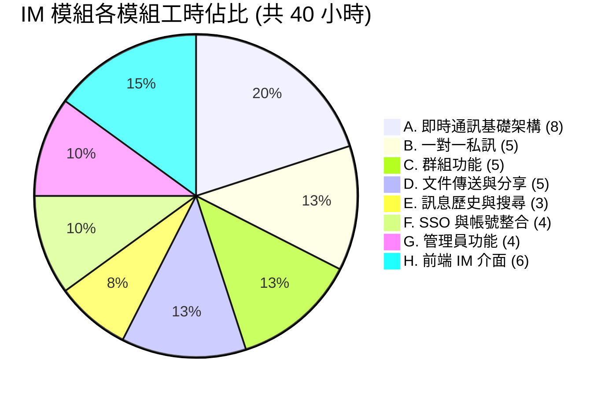
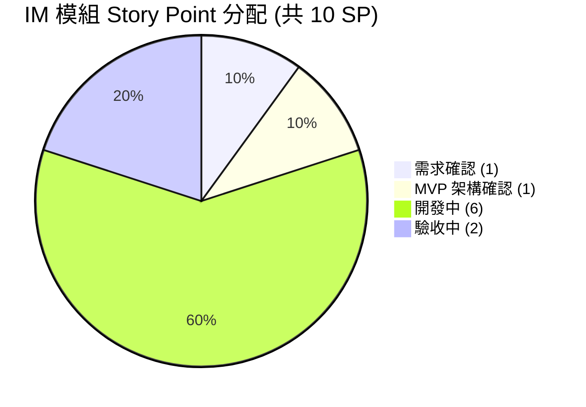

# AI Agents Office — 即時通訊模組（IM Module）工時與 Story Point 估算

本文件為《[PRD-im-client.md](PRD-im-client.md)》即時通訊模組的工時與 Story Point 估算。本模組為 AI Agents Office 的擴充功能，讓企業內部員工於同一平台內進行一對一私訊、群組協作與文件分享，沿用現有帳號、AD SSO 與儲存配額。

> 對應 PRD：PRD-im-client.md（v0.1 Draft，狀態：待客戶確認）
> 本估算以 **PRD 第 8 節「選項 B：獨立系統 + SSO（建議方向）」** 與 **第 7 節範圍（不含語音/視訊、訊息編輯撤回、AI Bot、對外開放、手機原生 App）** 為前提。

---

## 一、技術模組

| 層級 | 技術 |
|------|------|
| **後端框架** | Express 5 + TypeScript |
| **前端框架** | Next.js 15 (App Router) + React 19 |
| **即時傳輸** | WebSocket (Socket.IO) — 雙向即時收發、線上狀態、斷線重連 |
| **資料庫** | MySQL 8.x (mysql2/promise) |
| **認證機制** | 沿用現有 JWT + AD 單一登入 (SSO) |
| **檔案儲存** | 沿用現有沙箱與儲存配額機制 |
| **推播通知** | Web Notification API（桌面通知） |

---

## 二、核心功能模組 (8 大模組)

| 模組 | 複雜度 | 說明 |
|------|--------|------|
| **A. 即時通訊基礎架構** | 高 | WebSocket 連線管理、訊息收發協定、線上/離線狀態、斷線自動重連、已送達/已讀回執 |
| **B. 一對一私訊** | 中 | 企業內部使用者搜尋、文字訊息、引用回覆、新訊息桌面推播 |
| **C. 群組功能** | 中高 | 建立群組、成員新增/移除、群主轉讓、僅限邀請制（私密群組） |
| **D. 文件傳送與分享** | 中 | 檔案上傳、常見格式 (PDF/Word/Excel/PPT/圖片)、圖片預覽、AI 生成文件直接分享、對話內「檔案」頁籤 |
| **E. 訊息歷史與搜尋** | 中 | 訊息持久化、歷史訊息搜尋、訊息保留策略 |
| **F. SSO 與帳號整合** | 中 | 沿用現有帳號、AD 工號登入串接、IM 檔案計入現有儲存配額 |
| **G. 管理員功能** | 中 | 訊息記錄查閱（合規）、刪除違規訊息、群組查看/解散、停用使用者通訊 |
| **H. 前端 IM 介面** | 高 | 對話列表、聊天視窗、訊息氣泡、檔案預覽/下載、未讀標記、即時通知 |

---

## 三、功能模組說明

### A. 即時通訊基礎架構
| 功能項目 | 說明 |
|----------|------|
| WebSocket 連線 | 建立/維持雙向連線，使用者上線即訂閱個人與群組頻道 |
| 訊息收發協定 | 訊息送出 → 伺服器持久化 → 推送給對方/群組成員 |
| 線上狀態 | 線上 / 離線狀態維護與廣播 |
| 斷線重連 | 連線中斷自動重建，補齊離線期間訊息 |
| 送達/已讀回執 | 訊息狀態追蹤（已送達、已讀） |

### B. 一對一私訊
| 功能項目 | 說明 |
|----------|------|
| 使用者搜尋 | 搜尋企業內部使用者並發起對話 |
| 文字訊息 | 傳送文字、引用回覆特定訊息 |
| 推播通知 | 新訊息桌面通知 |

### C. 群組功能
| 功能項目 | 說明 |
|----------|------|
| 建立群組 | 建群並設定群組名稱 |
| 成員管理 | 新增、移除成員；轉讓群主角色 |
| 邀請制 | 僅限邀請加入，不開放公開搜尋（私密群組） |
| 群組訊息 | 群組訊息與文件分享，功能同一對一私訊 |

### D. 文件傳送與分享
| 功能項目 | 說明 |
|----------|------|
| 檔案上傳 | 對話中直接上傳並傳送檔案（預設單檔 50 MB） |
| 格式支援 | PDF / Word / Excel / PowerPoint / 圖片 |
| 預覽下載 | 圖片直接預覽，其他格式顯示檔名/大小並一鍵下載 |
| AI 文件分享 | 將 AI Agents Office 生成的文件直接分享至對話 |
| 檔案頁籤 | 對話內「檔案」頁籤集中查閱所有傳送過的檔案 |

### E. 訊息歷史與搜尋
| 功能項目 | 說明 |
|----------|------|
| 訊息持久化 | 完整保留對話與群組訊息紀錄 |
| 歷史搜尋 | 搜尋歷史訊息紀錄 |
| 保留策略 | 依設定保留期限（預設永久，待確認） |

### F. SSO 與帳號整合
| 功能項目 | 說明 |
|----------|------|
| 帳號沿用 | 使用現有 AI Agents Office 帳號，無需另外註冊 |
| AD 單一登入 | 沿用現有 AD 工號登入 |
| 儲存配額整合 | IM 傳送檔案計入使用者現有儲存配額 |

### G. 管理員功能
| 功能項目 | 說明 |
|----------|------|
| 訊息查閱 | 管理員查閱對話紀錄（合規用途） |
| 刪除違規訊息 | 刪除不當內容 |
| 群組管理 | 查看、解散群組 |
| 停用通訊 | 針對特定帳號暫停通訊功能 |

### H. 前端 IM 介面
| 功能項目 | 說明 |
|----------|------|
| 對話列表 | 私訊與群組列表、未讀標記、最近訊息預覽 |
| 聊天視窗 | 訊息氣泡、引用回覆、即時收發、線上狀態顯示 |
| 檔案區 | 檔案預覽/下載、對話內檔案頁籤 |
| 即時通知 | 新訊息桌面通知與未讀提示 |

---

## 四、工時總計

### 工時分佈圖

| 模組 | 小時 |
|------|------|
| A. 即時通訊基礎架構 | 8 |
| B. 一對一私訊 | 5 |
| C. 群組功能 | 5 |
| D. 文件傳送與分享 | 5 |
| E. 訊息歷史與搜尋 | 3 |
| F. SSO 與帳號整合 | 4 |
| G. 管理員功能 | 4 |
| H. 前端 IM 介面 | 6 |
| **合計** | **40 小時** |

---

### 專案 Story Point 分配

本模組總計 **10 SP**（1 SP = NT$20,000），各階段分配如下：

| 階段 | SP | 佔比 | 說明 |
|------|:--:|------|------|
| 需求確認 | 1 | 10% | PRD 待確認事項回覆、功能範圍與使用情境定義（對應 PRD 第 9 節 8 項待確認） |
| MVP 架構確認 | 1 | 10% | 整合方式確認（選項 B：獨立系統 + SSO）、WebSocket 架構、資料庫與介面原型 |
| 開案確認 | 0 | 0% | — |
| 開發中 | 6 | 60% | 8 大模組開發、WebSocket 即時通訊、群組/檔案/管理員功能、前端 IM 介面 |
| 驗收中 | 2 | 20% | 整合測試、SSO 串接驗證、效能與並發測試、部署上線 |
| 已結案 | 0 | 0% | — |
| **合計** | **10** | **100%** | |

---

## 五、交付項目

1. 即時通訊模組（一對一私訊 + 群組 + 文件分享）
2. WebSocket 即時通訊基礎架構（含斷線重連、已讀回執）
3. 與現有系統整合（帳號 / AD SSO / 儲存配額 / AI 文件分享）
4. 管理員通訊管理功能（訊息查閱、違規刪除、群組管理、停用通訊）
5. 前端 IM 介面（對話列表、聊天視窗、檔案區、桌面通知）

---

## 六、估算前提與待確認事項

本估算以下列前提成立為準，若 PRD 第 9 節待確認事項回覆有變動，SP 須重新評估：

| # | 待確認項目 | 本估算採用之前提 |
|---|-----------|------------------|
| 1 | 整合方式 | 獨立系統 + SSO（PRD 選項 B 建議方向） |
| 2 | 預計同時在線人數 | 中小規模（單一 WebSocket 節點可承載），大規模需加叢集/負載均衡 |
| 3 | 群組成員上限 | 100 人 |
| 4 | 訊息保留期限 | 永久 |
| 5 | 檔案儲存空間 | 計入現有 2GB 配額 |
| 6 | 單檔大小上限 | 50 MB |
| 7 | 訊息查閱合規 | 沿用現有管理權限模型 |
| 8 | 上線時程 | 依排程另議 |

> 註：PRD 第 7 節「不包含範圍」（語音/視訊通話、訊息編輯撤回、AI Bot 自動回覆、對外開放、手機原生 App）**不在本 10 SP 估算內**，如需納入須另行評估。

---

*估算日期: 2026-06-09*
