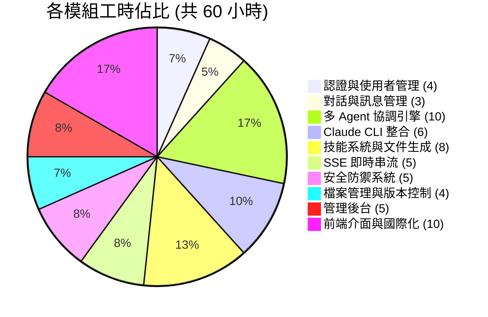
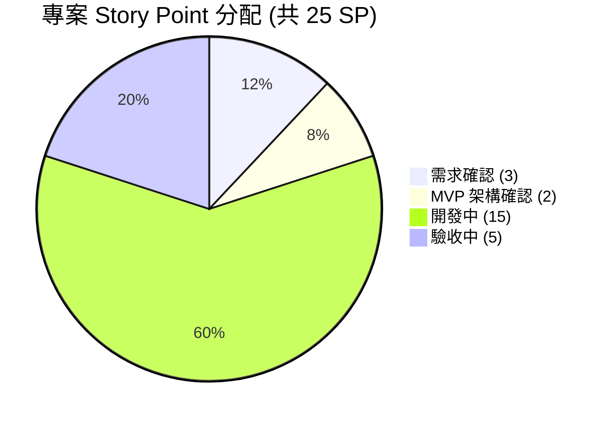

# AI Agents Office 智慧文件生成平台

本系統為 AI Agents Office 智慧文件生成平台，採用多 Agent 協調架構，使用者透過對話介面描述需求，系統自動拆解任務並派遣專業 Agent 協作，產出 PowerPoint、Word、Excel、PDF、Web 簡報等商業文件。全程本機部署，資料不離開企業環境，支援即時串流回饋、檔案版本控制、5 層安全防禦與完整管理後台。

---

## 一、技術模組

| 層級 | 技術 |
|------|------|
| **後端框架** | Express 5 + TypeScript |
| **前端框架** | Next.js 15 (App Router) + React 19 |
| **樣式系統** | Tailwind CSS v4 |
| **資料庫** | MySQL 8.x (mysql2/promise) |
| **AI 引擎** | Claude CLI (本機 spawn process) |
| **即時通訊** | SSE (Server-Sent Events) |
| **認證機制** | JWT + bcrypt + Google OAuth 2.0 |
| **文件生成** | pptxgenjs / docx / exceljs / pdfkit / Reveal.js |
| **圖表視覺化** | Recharts / Mermaid / Markmap / React-Leaflet |
| **國際化** | 繁中 / 簡中 / 英文 (lazy-load) |

---

## 二、核心功能模組 (10 大模組)

| 模組 | 複雜度 | 說明 |
|------|--------|------|
| **1. 認證與使用者管理** | 低中 | Email/密碼 + Google OAuth 登入、JWT Token、登入鎖定、角色權限 |
| **2. 對話與訊息管理** | 中 | 對話 CRUD、訊息歷史、模式自動判斷 (Direct/Orchestrated)、對話分享 |
| **3. 多 Agent 協調引擎** | 極高 | Router Agent 任務拆解、Pipeline 串行/並行、多輪迭代 (max 3)、結果回饋截斷 |
| **4. Claude CLI 整合** | 高 | CLI 路徑解析 (Windows .cmd 處理)、Process spawn/管理、Session 持久化與 Resume |
| **5. 技能系統與文件生成** | 高 | 11 個 Skill 定義、SKILL.md 載入/快取、5 套 Generator 腳本、系統提示詞組裝 |
| **6. SSE 即時串流** | 高 | 直連 Express 繞過 proxy、12 種事件類型、keepalive、Agent 活動即時回報 |
| **7. 安全防禦系統** | 高 | 5 層縱深防禦、7 種輸入偵測器、沙箱路徑隔離、工具白/黑名單、安全審計日誌 |
| **8. 檔案管理與版本控制** | 中高 | 檔案掃描/註冊、版本快照與備份、上傳掃描、儲存配額管理 |
| **9. 管理後台** | 中高 | 系統總覽 + 使用者管理 + 技能管理 + Token 帳本 + 安全監控 + 系統設定 (6 頁) |
| **10. 前端介面與國際化** | 高 | 聊天 UI (SSE + 圖表 + 檔案預覽)、多頁面、側邊欄、3 語系、深淺主題 |

---

## 三、專案特色與亮點

1. **多 Agent 智慧協調** — Router Agent 自動分析需求，拆解為研究、規劃、生成等步驟，派遣 Worker Agents 串行或並行執行，最多 3 輪迭代修正
2. **11 種專業 Agent** — 涵蓋研究、規劃、審查、資料分析、跨文件分析、5 種文件生成 (PPT/Word/Excel/PDF/Web 簡報)
3. **本機部署零外洩** — 所有 AI 運算與檔案儲存在本機完成，資料不經過第三方雲端
4. **5 層安全縱深防禦** — 輸入偵測 → 路徑驗證 → 工具限制 → 行為規則 → 檔案隔離
5. **即時透明串流** — SSE 即時回報 AI 工具活動、任務進度、檔案生成通知，使用者全程掌握
6. **自動版本管理** — 同名文件自動版本化 (v1, v2...)，隨時回溯歷史版本
7. **對話式迭代修改** — 不滿意直接對話修改，不需從頭來過
8. **完整管理後台** — 使用者管理、Token 計費監控、安全審計、系統設定一站式管理

---

## 四、功能模組說明

### A. 認證與使用者管理

| 功能項目 | 說明 |
|----------|------|
| Email 帳號註冊/登入 | bcrypt 加密密碼、JWT Token (7 天效期) |
| Google OAuth SSO | 支援 Google 企業帳號單一登入，雙模式 (ID Token / Access Token) |
| 登入保護 | 5 次失敗鎖定 15 分鐘、認證速率限制 (10/min per IP) |
| 角色權限 | user / admin 兩級角色、管理員獨立路由保護 |
| 使用者偏好 | 語系 (zh-TW/zh-CN/en)、主題 (dark/light)，同步至 Server 端 |

### B. 對話與訊息管理

| 功能項目 | 說明 |
|----------|------|
| 對話 CRUD | 建立、列表、搜尋、重命名、刪除對話 |
| 訊息歷史 | 完整保留對話紀錄，含 metadata (工具活動、Token 用量) |
| 模式判斷 | 自動判斷 Direct (單一 Agent) 或 Orchestrated (多 Agent 協調) 模式 |
| 技能綁定 | 對話可綁定特定技能，後續訊息直接使用該 Agent |
| 對話分享 | 產生公開 Token 連結，供他人唯讀瀏覽 |

### C. 多 Agent 協調引擎

| 功能項目 | 說明 |
|----------|------|
| Router Agent | 分析使用者需求，輸出 [TASK]/[PIPELINE] 結構化任務指令 |
| Task Parser | 解析 Router 輸出，區分串行 Pipeline、並行 Pipeline、獨立 Task |
| Worker 派遣 | 依任務類型 spawn 對應 Worker Agent，傳入任務描述與上下文 |
| 結果回饋 | Worker 結果截斷至 1,500 字元回饋 Router，避免 Token 爆量 |
| 多輪迭代 | Router 可進行最多 3 輪迭代，逐步完善產出 |
| 超時保護 | 單一 Agent 1.5~10 分鐘超時、整體協調 15 分鐘上限 |
| Partial Output | Agent 超時但已有部分產出時，取用已完成部分 |

### D. Claude CLI 整合

| 功能項目 | 說明 |
|----------|------|
| CLI 路徑解析 | 自動解析 Windows .cmd wrapper，直接以 Node 執行避免相容問題 |
| Process Spawn | 每個 Agent 獨立 process，stdin 寫入訊息、stdout 逐行解析 JSON |
| Session 管理 | Router 跨輪次保持 Session、Worker 單次任務使用 |
| Resume 機制 | Session 斷線自動重建，注入歷史訊息維持對話脈絡 |
| 工具權限控制 | 依角色設定 allowedTools / disallowedTools，Router 零工具 |

### E. 技能系統與文件生成

| 功能項目 | 說明 |
|----------|------|
| 技能定義 | 每個 Skill 以 SKILL.md 定義 (YAML frontmatter + 系統提示詞) |
| 技能載入 | 啟動時載入並快取，支援 dev mode 熱重載 |
| 11 個 Agent | router / research / planner / reviewer / data-analyst / rag-analyst / pptx-gen / docx-gen / xlsx-gen / pdf-gen / slides-gen |
| Generator 腳本 | 5 套獨立腳本 (pptxgenjs / docx / exceljs / pdfkit / Reveal.js) |
| 提示詞組裝 | 語言指示 + Skill 內容 + 沙箱規則 + Generator 文件 + References |

### F. SSE 即時串流

| 功能項目 | 說明 |
|----------|------|
| 直連架構 | 前端直連 Express 繞過 Next.js proxy，避免 response buffering |
| 12 種事件 | text / thinking / tool_activity / task_dispatched / task_completed / task_failed / pipeline_started / pipeline_completed / router_plan / agent_stream / file_generated / usage / done |
| Keepalive | 每 10 秒心跳防止連線逾時 |
| 工具解析 | 前端 90+ 種模式解析，將工具活動轉為人類可讀描述 |
| Agent 面板 | 多 Agent 模式下即時顯示各 Agent 任務狀態與計時 |

### G. 安全防禦系統

| 功能項目 | 說明 |
|----------|------|
| L1 輸入偵測 | 7 種偵測器 (標籤注入/語意攻擊/Unicode 混淆/Base64/路徑穿越/公式注入/升權)，分數制封鎖 |
| L2 路徑驗證 | ID 白名單 [a-zA-Z0-9_-]、resolved path 檢查防穿越 |
| L3 工具限制 | Worker 白名單 (Bash/Write/Read/WebSearch/WebFetch)、黑名單 (rm/del/sudo/curl/wget 等) |
| L4 行為規則 | 9 條沙箱規則注入 Agent 系統提示詞 (禁 cd / 禁 ../ / 禁刪除等) |
| L5 檔案隔離 | workspace/{userId}/{conversationId}/ 三級隔離 |
| 審計日誌 | 所有安全事件記錄至 security_events 表 |

### H. 檔案管理與版本控制

| 功能項目 | 說明 |
|----------|------|
| 檔案掃描 | 生成後遞迴掃描沙箱，白名單副檔名過濾 |
| 版本快照 | 生成前快照現有檔案，同名不同大小自動產生 .v{n} 備份 |
| 上傳管理 | 多檔上傳、安全掃描 (clean/suspicious/rejected)、配額管理 |
| 上傳注入 | 上傳檔案自動注入 Agent 提示詞，含路徑與分類 (資料檔/圖片) |
| 預覽支援 | PDF/HTML iframe 預覽、Office 首頁預覽、一鍵下載 |
| 儲存配額 | 每使用者 2GB 預設配額，管理員可調整 |

### I. 管理後台

| 功能項目 | 說明 |
|----------|------|
| 系統總覽 | 使用者數、檔案數、Token 速率圖表 (7d/30d)、近期活動 |
| 使用者管理 | 帳號 CRUD、角色設定、狀態管理 (active/pending/suspended)、額度調整 |
| 技能管理 | 技能清單、啟停控制、執行指標 |
| Token 帳本 | 用量明細、預算追蹤、月度配額、CSV 匯出 |
| 安全監控 | 安全事件日誌、IP 白名單、速率限制規則、登入追蹤 |
| 系統設定 | 全域參數 (費用上限/儲存配額/上傳限制)、功能開關 |

### J. 前端介面與國際化

| 功能項目 | 說明 |
|----------|------|
| 聊天主頁 | SSE 即時串流 + 工具活動面板 + Agent 任務追蹤 + 檔案預覽 + 版本切換 |
| 內嵌圖表 | Recharts (長條/折線/圓餅/雷達/散佈) / Mermaid (流程圖) / Markmap (心智圖) / Leaflet (地圖) |
| 儀表板 | 快速建立對話、近期檔案、統計摘要 |
| 檔案管理 | 生成檔案 + 上傳檔案統一管理，含篩選/搜尋/分頁 |
| 用量統計 | 每日圖表、累計用量、CSV 匯出 |
| 側邊欄導航 | 可收合側邊欄、文件類型快選、對話搜尋 |
| 3 語系 | 繁中 (內建) / 簡中 / 英文 (lazy-load)、參數插值 |
| 深淺主題 | dark / light 即時切換、localStorage + Server 同步 |
| Honeypot | 註冊頁隱藏欄位防機器人 |

---

## 五、工時總計

### 工時分佈圖

| 模組 | 小時 |
|------|------|
| A. 認證與使用者管理 | 4 |
| B. 對話與訊息管理 | 3 |
| C. 多 Agent 協調引擎 | 10 |
| D. Claude CLI 整合 | 6 |
| E. 技能系統與文件生成 | 8 |
| F. SSE 即時串流 | 5 |
| G. 安全防禦系統 | 5 |
| H. 檔案管理與版本控制 | 4 |
| I. 管理後台 | 5 |
| J. 前端介面與國際化 | 10 |
| **合計** | **60 小時** |

---

### 專案 Story Point 分配

本專案總計 **25 SP**（1 SP = NT$20,000），各階段分配如下：

| 階段 | SP | 佔比 | 說明 |
|------|:--:|------|------|
| 需求確認 | 3 | 12% | 需求訪談、功能範圍確認、使用情境定義 |
| MVP 架構確認 | 2 | 8% | 技術架構設計、資料庫規劃、介面原型確認 |
| 開案確認 | 0 | 0% | — |
| 開發中 | 15 | 60% | 10 大模組開發、前後端整合、技能建置 |
| 驗收中 | 5 | 20% | 整合測試、安全驗證、效能調校、部署上線 |
| 已結案 | 0 | 0% | — |
| **合計** | **25** | **100%** | |

---

## 六、交付項目

1. 完整的 AI Agents Office 智慧文件生成平台
2. 11 個 AI Agent 技能定義與系統提示詞
3. 5 套文件 Generator 腳本 (PPT / Word / Excel / PDF / Web 簡報)
4. 管理後台 (6 頁功能)
5. 3 語系翻譯檔 (繁中 / 簡中 / 英文)
6. 系統設計文件 (SDD)
7. 產品需求文件 (PRD)

---

*報告日期: 2026-03-25*
