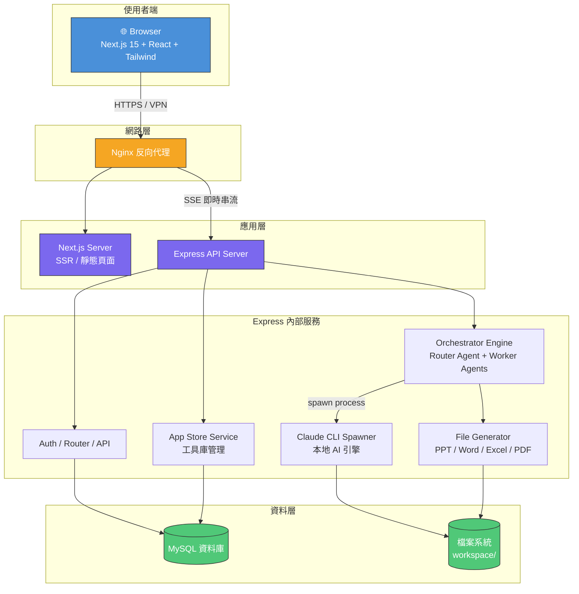
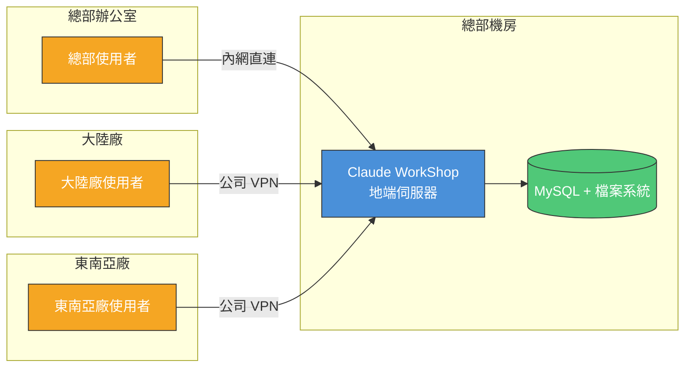
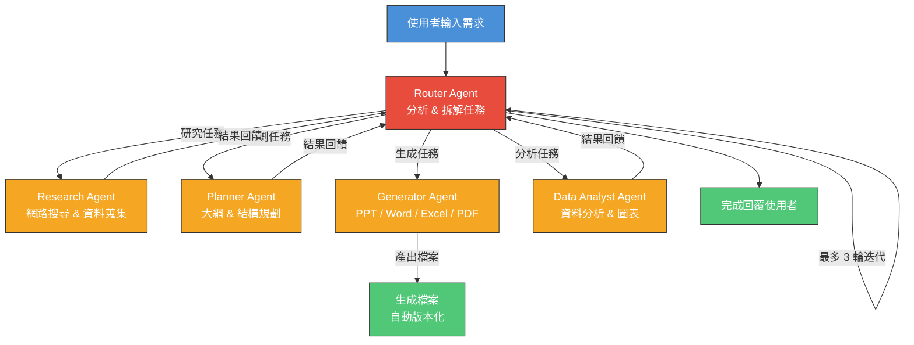

# Claude WorkShop 協作平台 — 產品需求文件 (PRD)

> **文件編號**: PRD-2026-017
> **產品名稱**: Claude WorkShop 協作平台
> **版本**: v1.0
> **撰寫日期**: 2026-04-13
> **需求來源**: REQ-2026-017 需求會議紀錄

---

## 一、產品概述

### 1.1 產品定位

Claude WorkShop 是一套**企業級地端化 AI 開發協作平台**。讓公司內所有人（包含海外廠區）透過統一的 Web 介面使用 Claude AI 服務，同時確保所有資料不離開企業環境。

簡單說：**公司自己的 AI 工作站，安全、統一、人人都能用。**

### 1.2 解決什麼問題

| 現況問題 | Claude WorkShop 怎麼解 |
|----------|----------------------|
| 海外廠用不到 Claude | 地端部署 + VPN，全球統一存取 |
| 各自找雲端工具，資料亂上雲 | 統一入口，資料留在公司 |
| 做出來的東西散落個人電腦 | 內部 App 工具庫，成果集中保存 |
| 新手不會用，資深被迫教學 | 對話式介面 + 範本系統，30 分鐘上手 |

### 1.3 產品願景

> 讓每位員工都有一個 AI 助手，不用擔心資料外洩、不用自己找工具、不用從零學起。做出來的東西留在公司，別人能直接拿去用。

---

## 二、使用者角色

### 2.1 角色定義

| 角色 | 誰 | 主要需求 |
|------|-----|---------|
| **一般使用者** | 工程師、PM、設計師等 | 用 AI 輔助工作、生成文件、分析資料 |
| **小白開發者** | 初階工程師、非技術背景人員 | 用最簡單的方式完成 AI 輔助任務 |
| **App 開發者** | 有經驗的工程師 | 用 AI 開發工具並上架分享 |
| **部門主管** | 各部門管理者 | 看團隊用量、控制成本 |
| **系統管理員** | IT 管理人員 | 管帳號、管權限、管安全、管配額 |
| **海外廠使用者** | 大陸廠 / 東南亞廠同仁 | 跟總部用一樣的工具 |

### 2.2 使用場景

**場景 A：海外工程師需要 AI 輔助寫程式**
> 大陸廠的小明之前用不了 Claude，只能手動寫。現在透過公司 VPN 開啟 Claude WorkShop，直接在對話框貼上程式碼，AI 幫他 Code Review 和修 Bug。所有對話記錄留在公司內網。

**場景 B：PM 需要快速產出簡報**
> PM Amy 下午要跟客戶提案，她在 Claude WorkShop 輸入「幫我做一份 Q2 銷售分析簡報，風格要專業」，上傳 Excel 銷售數據，AI 自動分析數據並生成 PPT，10 分鐘搞定。

**場景 C：資深工程師做了好用的小工具**
> 資深工程師 Kevin 用 AI 做了一個 Log 分析工具，以前只存在自己電腦。現在上架到 App 工具庫，寫好說明，其他同事搜尋「Log 分析」就能找到，一鍵部署到自己的環境直接用。

**場景 D：新人第一天就能用 AI**
> 剛入職的新人小華，打開 Claude WorkShop，首頁就有「新手引導」，提供常用範本：程式碼助手、文件生成、資料分析。選一個範本，照著提示輸入需求，馬上得到結果。不用裝 CLI、不用設定 API Key。

**場景 E：主管要看團隊 AI 使用狀況**
> 部門主管想知道團隊這個月 AI 用了多少 Token、花了多少錢。打開管理後台，部門用量報表一目了然，還能設定預算上限，超過自動提醒。

---

## 三、功能需求

### 3.1 P0 — 核心功能（MVP 必須）

#### F1：地端化 Claude 服務

| 項目 | 說明 |
|------|------|
| 部署方式 | 公司內網伺服器部署，支援 Docker 容器化 |
| AI 引擎 | Claude CLI 本機 spawn process，不走外部 API |
| 網路架構 | Nginx 反向代理，海外廠區透過 VPN 連入 |
| 資料隔離 | 所有對話、檔案、日誌儲存於公司資料庫與檔案系統 |

**User Stories：**
- 身為 IT 管理員，我可以在公司伺服器上一鍵部署 Claude WorkShop，不需要連外網
- 身為海外廠工程師，我可以透過 VPN 存取 Claude WorkShop，體驗與總部一致
- 身為資安主管，我可以確認所有 AI 資料都留在公司內網，不會外洩到第三方

#### F2：統一對話介面

| 項目 | 說明 |
|------|------|
| 介面形式 | Web-based 聊天 UI（類似 ChatGPT 體驗） |
| 對話管理 | 建立 / 列表 / 搜尋 / 重命名 / 刪除 |
| 即時串流 | SSE 即時顯示 AI 回應，含工具活動與進度 |
| 訊息格式 | 支援 Markdown、程式碼高亮、表格 |
| 多輪對話 | 保留完整對話脈絡，AI 理解上下文 |

**User Stories：**
- 身為使用者，我可以在網頁上直接跟 AI 對話，不需要安裝任何軟體
- 身為使用者，我可以看到 AI 回應的即時串流過程，知道它正在做什麼
- 身為使用者，我可以回顧過去的對話紀錄，繼續之前的工作

#### F3：使用者與權限管理

| 項目 | 說明 |
|------|------|
| 註冊登入 | Email/密碼 + 企業 SSO (Google OAuth) |
| 角色分級 | 管理員 / 一般使用者（可擴充部門主管） |
| 登入保護 | 5 次失敗鎖定 15 分鐘、速率限制 |
| 配額管理 | 每人 Token 配額、管理員可調整 |

**User Stories：**
- 身為新員工，我可以用公司 Google 帳號一鍵登入
- 身為管理員，我可以停用離職員工的帳號，其歷史資料保留不刪除
- 身為管理員，我可以為不同使用者設定不同的 Token 配額

#### F4：用量監控與計費

| 項目 | 說明 |
|------|------|
| Token 追蹤 | 每次對話記錄 input/output Token 數 |
| 成本估算 | 依模型定價自動計算費用 |
| 報表維度 | 個人 / 部門 / 全公司，7 天 / 30 天 |
| 預算控管 | 設定配額上限，超額提醒或暫停 |

**User Stories：**
- 身為使用者，我可以看到自己今天用了多少 Token、花了多少錢
- 身為部門主管，我可以看到部門整體的 AI 用量報表
- 身為管理員，我可以設定公司級的月度預算上限

---

### 3.2 P1 — 重要功能（第二階段）

#### F5：文件自動生成

| 項目 | 說明 |
|------|------|
| 支援格式 | PPT (.pptx)、Word (.docx)、Excel (.xlsx)、PDF (.pdf)、Web 簡報 (.html) |
| 範本風格 | 每種格式 4-8 種專業風格可選 |
| 檔案預覽 | 生成後直接在網頁預覽，一鍵下載 |
| 迭代修改 | 不滿意直接在對話中修改，不需從頭來 |

**User Stories：**
- 身為 PM，我可以描述需求讓 AI 自動生成 PPT 簡報
- 身為使用者，我可以上傳 Excel 資料讓 AI 分析後生成圖表報告
- 身為使用者，我可以在對話中要求修改已生成的文件（換風格、改內容）

#### F6：內部 App 工具庫

| 項目 | 說明 |
|------|------|
| 上架機制 | 開發者填寫名稱、說明、分類、使用方式後上架 |
| 搜尋瀏覽 | 依分類 / 關鍵字 / 熱門度搜尋 |
| 一鍵部署 | 使用者選擇 App 後一鍵啟動，不需設定環境 |
| 版本管理 | App 更新自動版本化，使用者可選擇版本 |
| 評價回饋 | 使用者可評分、留言，幫助品質篩選 |

**User Stories：**
- 身為開發者，我可以把做好的工具上架到公司 App Store，讓其他人使用
- 身為使用者，我可以搜尋「報表產生器」找到同事做好的工具，一鍵部署
- 身為使用者，我可以對好用的 App 點讚和留言，讓更多人發現它
- 身為開發者，我可以更新我的 App 版本，舊版本使用者不受影響

#### F7：範本與新手引導

| 項目 | 說明 |
|------|------|
| 範本庫 | 預設 Prompt 範本（程式碼助手、文件生成、資料分析等） |
| 新手引導 | 首次登入互動式引導，帶領完成第一次 AI 對話 |
| 使用範例 | 每個範本附帶使用範例與預期效果 |
| 自訂範本 | 進階使用者可建立並分享自己的範本 |

**User Stories：**
- 身為新手，我第一次打開平台就有引導告訴我怎麼開始
- 身為新手，我可以從範本庫選一個「程式碼助手」直接用，不用自己想 Prompt
- 身為資深工程師，我可以把我常用的 Prompt 存成範本分享給團隊

#### F8：檔案版本控制

| 項目 | 說明 |
|------|------|
| 自動版本化 | 同名文件重新生成時自動建立新版本 |
| 歷史回溯 | 可瀏覽所有歷史版本並下載任意版本 |
| 儲存配額 | 每人預設 2GB，管理員可調整 |
| 檔案分享 | 產生公開連結分享給他人瀏覽 |

**User Stories：**
- 身為使用者，我修改文件後舊版本自動保留，隨時可以切回去
- 身為使用者，我可以產生分享連結讓客戶預覽文件，不需登入

---

### 3.3 P2 — 進階功能（第三階段）

#### F9：多 Agent 智慧協作

| 項目 | 說明 |
|------|------|
| Router Agent | 自動分析需求，拆解為子任務 |
| Worker Agents | 研究、規劃、審查、資料分析、文件生成等專業 Agent |
| 任務串接 | 支援串行 Pipeline 與並行執行 |
| 多輪迭代 | 最多 3 輪自動修正，逐步完善產出 |

**User Stories：**
- 身為使用者，我描述一個複雜需求，系統自動拆解成多個步驟由不同 AI 完成
- 身為使用者，我可以即時看到每個 Agent 的工作進度

#### F10：稽核與安全

| 項目 | 說明 |
|------|------|
| 操作日誌 | 所有使用行為記錄（登入、對話、檔案、管理操作） |
| 安全偵測 | Prompt 注入偵測、路徑穿越防護 |
| 工具限制 | 依角色限制 AI 可使用的工具 |
| 安全報表 | 安全事件統計與趨勢圖 |

#### F11：管理後台

| 項目 | 說明 |
|------|------|
| 系統總覽 | 使用者數、檔案數、Token 速率圖表、近期活動 |
| 使用者管理 | CRUD、角色設定、狀態管理、額度調整 |
| 技能管理 | AI Agent 技能清單、啟停控制 |
| Token 帳本 | 用量明細、預算追蹤、匯出 CSV |
| 安全監控 | 安全事件、登入追蹤、IP 管理 |
| 系統設定 | 全域參數（費用上限、儲存配額、功能開關） |

#### F12：海外廠適配

| 項目 | 說明 |
|------|------|
| 多語系 | 繁體中文 / 簡體中文 / English |
| 低頻寬優化 | 壓縮傳輸、漸進式載入 |
| 時區支援 | 依使用者所在地顯示當地時間 |

---

## 四、非功能性需求

### 4.1 效能

| 項目 | 指標 |
|------|------|
| 頁面載入 | 首頁 < 3 秒（內網環境） |
| AI 回應延遲 | 首 Token < 2 秒（SSE 串流） |
| 同時在線 | 支援 100+ 同時使用者 |
| 檔案生成 | PPT/Word < 30 秒、Excel/PDF < 15 秒 |

### 4.2 安全

| 項目 | 要求 |
|------|------|
| 資料傳輸 | HTTPS / TLS 加密 |
| 密碼儲存 | bcrypt 加密（12 rounds） |
| Token 有效期 | JWT 7 天，可強制失效 |
| 檔案隔離 | 使用者間檔案完全隔離（workspace/{userId}/） |
| 輸入防護 | Prompt 注入偵測、XSS/SQL injection 防護 |

### 4.3 可用性

| 項目 | 要求 |
|------|------|
| 瀏覽器支援 | Chrome / Edge / Firefox（最新兩個版本） |
| 響應式設計 | 支援桌面與平板瀏覽 |
| 深淺主題 | 支援 Dark / Light 模式切換 |
| 無障礙 | 基本鍵盤操作支援 |

### 4.4 部署與維運

| 項目 | 要求 |
|------|------|
| 部署方式 | Docker 容器化，一鍵啟動 |
| 作業系統 | Linux (Ubuntu 22.04+) / Windows Server |
| 資料庫 | MySQL 8.x |
| 備份 | 支援資料庫定期自動備份 |
| 監控 | 系統健康狀態 API、管理後台可視化 |

---

## 五、系統架構（概要）

### 海外廠區存取架構

### 多 Agent 協作流程

---

## 六、里程碑與排程

### Phase 1 — MVP（P0 功能）

| 里程碑 | 內容 | 預計時間 |
|--------|------|----------|
| M1 | 地端部署 + 基本對話介面 + 帳號登入 | 第 1-3 週 |
| M2 | SSE 串流 + 用量追蹤 + 權限管理 | 第 4-5 週 |
| M3 | MVP 內部測試 + Bug 修復 | 第 6 週 |
| **MVP 上線** | 總部先行使用 | **第 6 週末** |

### Phase 2 — 重要功能（P1）

| 里程碑 | 內容 | 預計時間 |
|--------|------|----------|
| M4 | 文件生成（PPT/Word/Excel/PDF） | 第 7-9 週 |
| M5 | App 工具庫 + 範本系統 | 第 10-12 週 |
| M6 | 檔案版本控制 + 分享功能 | 第 13 週 |
| **Phase 2 上線** | 開放海外廠使用 | **第 13 週末** |

### Phase 3 — 進階功能（P2）

| 里程碑 | 內容 | 預計時間 |
|--------|------|----------|
| M7 | 多 Agent 協作引擎 | 第 14-16 週 |
| M8 | 管理後台 + 稽核系統 | 第 17-18 週 |
| M9 | 海外廠適配 + 多語系 | 第 19 週 |
| **正式版上線** | 全公司推廣 | **第 20 週** |

---

## 七、成功指標

| 指標 | 目標值 | 量測方式 |
|------|--------|----------|
| 海外廠可用性 | 100% 廠區可正常使用 | VPN 連線測試 |
| 資料外洩事件 | 零 | 安全稽核日誌 |
| 雲端工具替代率 | 上線後降低 80% | 問卷調查 |
| 開發者採用率 | 3 個月內 > 60% | 平台註冊 / 活躍數 |
| 重複開發率 | 降低 50% | App 工具庫複用次數 |
| 新手上手時間 | < 30 分鐘 | 新人首次完成任務時間 |
| App 工具庫上架數 | 3 個月內 > 20 個 | 平台統計 |

---

## 八、風險與對策

| 風險 | 影響 | 對策 |
|------|------|------|
| 海外 VPN 頻寬不足 | AI 回應慢、體驗差 | 低頻寬優化、回應壓縮、可考慮海外節點 |
| 使用者抵觸新工具 | 採用率低 | 種子用戶計畫、範本庫降低門檻、內部推廣 |
| Claude CLI 版本更新 | 可能導致不相容 | 版本鎖定、更新前測試環境驗證 |
| Token 費用超預算 | 成本失控 | 配額管理、預算上限、用量告警 |
| 地端伺服器效能瓶頸 | 多人同時使用卡頓 | 負載監控、彈性擴容規劃 |

---

## 九、驗收標準

### MVP 驗收（Phase 1）

- [ ] 公司內網可正常存取 Claude WorkShop
- [ ] 海外廠區透過 VPN 可正常使用（回應延遲 < 5 秒）
- [ ] 使用者可註冊 / 登入 / 多輪對話
- [ ] AI 回應即時串流顯示
- [ ] Token 用量正確記錄
- [ ] 所有資料確認留在地端（無外部 API 呼叫）

### 完整版驗收（Phase 3）

- [ ] 5 種文件格式可正常生成與下載
- [ ] App 工具庫上架 / 搜尋 / 部署流程順暢
- [ ] 新手引導完成率 > 80%
- [ ] 管理後台所有功能正常運作
- [ ] 安全稽核日誌完整記錄
- [ ] 繁中 / 簡中 / 英文三語系切換正常

---

*本文件依據 REQ-2026-017 需求會議紀錄撰寫，後續將依此展開技術架構設計 (SDD)。*
